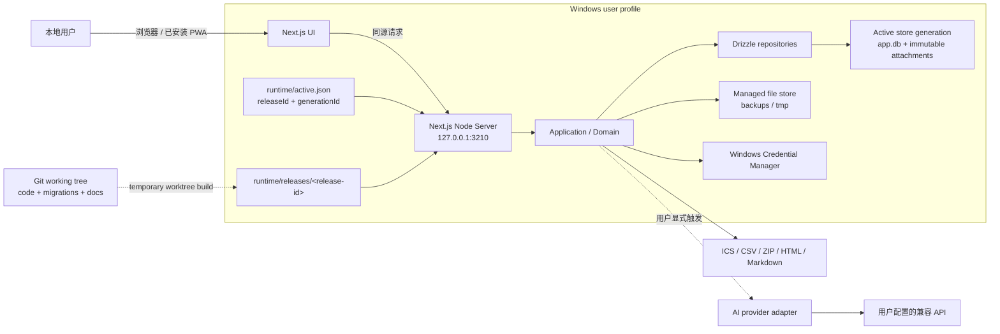
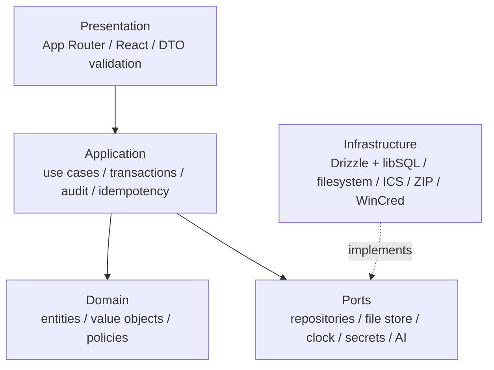

# 秋招进度板：系统架构

> 文档状态：已确认，可进入实现
> 适用范围：Windows 本地单用户版本
> 关联决策：[ADR-0001 本地优先](adr/0001-local-first.md) · [ADR-0002 数据置于仓库外](adr/0002-user-data-outside-repo.md) · [ADR-0003 Web 技术栈](adr/0003-web-stack.md)

## 1. 架构目标与边界

本架构为 [PRD](PRD.md) 中三个里程碑提供同一条可持续演进的实现路径。优先级依次为：

1. 用户数据可恢复，代码更新不能以个人求职记录为试错代价；
2. 核心申请、事件和下一步流程在断网时完整可用；
3. 业务规则只有一个事实来源，UI、导入和 AI 生成的 `CaptureDraft` 不能绕过；
4. 日常启动足够简单，朋友克隆后无需 Docker 或云账号；
5. 客户端、数据库、文件和外部网络之间有清楚的安全边界。

首版是本地应用，不是部署在公网的 SaaS。每个克隆在当前 Windows 账户下使用一个独立工作区；不包含登录、远程管理、云同步或多租户授权。

## 2. 系统上下文



关键边界：

- 浏览器只接触经过 DTO 序列化的数据，不读取数据库文件、任意本地路径或 API Key。
- Node Server 是唯一正式写入口；CLI 维护命令只在服务停止并取得独占维护锁后写入。
- Git 工作树与用户数据目录完全分离。
- 运行时以不可变 release 发布；更新和恢复以新 generation 发布数据。唯一的 `runtime/active.json` 把两者组成一个可原子切换的活动版本。
- 除用户主动打开外部链接、更新代码或调用 AI 外，核心运行没有外部网络依赖。

## 3. 技术基线

| 能力 | 技术 | 架构用途 |
| --- | --- | --- |
| 全栈 Web | Next.js 16 App Router | 页面、Server Components、同源写入端点、文件下载 |
| UI | React 19 + TypeScript | 响应式视图、交互状态、严格 DTO 类型 |
| 运行时 | Node.js 24 LTS | 本地生产服务、文件系统、压缩、系统适配器 |
| 数据访问 | Drizzle ORM 稳定版 | 类型化查询、仓储实现、版本化 schema |
| 数据库 | `@libsql/client` + 本地 SQLite/libSQL `file:` URL | 单机事务型事实来源 |
| 测试 | Vitest + Playwright | 领域/集成测试与真实浏览器关键流程 |
| 分发 | Git + npm lockfile + Windows `.cmd` 脚本 | 可重复初始化、启动和安全更新 |

依赖只允许使用 lockfile 中经过测试的确定版本。Next.js 16 要求 Node.js 20.9+；采用 Node.js 24 LTS。主版本升级必须单独验证，不能由日常启动隐式发生。

## 4. 运行拓扑

### 4.1 日常进程

- `start.cmd` 经启动维护 helper 读取 `runtime/active.json`，启动其指向的 production release，而不是仓库中的 `next dev` 或“最新”目录。
- 生产服务固定使用 origin `http://127.0.0.1:3210`；禁止绑定 `0.0.0.0`、机器名、局域网网卡，也绝不静默改用其他端口。这个稳定 origin 是 M3 Service Worker、IndexedDB、通知权限和已安装 PWA 身份不漂移的前提。
- 启动器使用 `runtime` 目录中的进程锁和端口探测保证单实例。若 3210 上是同一安装、同一 active release/generation 的健康实例，只打开现有地址；否则以端口占用错误退出并提示用户处理占用进程。
- 启动器等待 `/api/health` 返回安装标识、`releaseId`、`generationId`、应用版本、数据库 schema 版本和只读健康状态，并与 `active.json` 一致后才打开浏览器。
- `start.cmd` 窗口就是应用的前台运行状态：关闭窗口必须向 Node Server 发出优雅停止信号，等待数据库句柄和锁释放后退出。首版不注册 Windows 服务、不创建托盘常驻进程，也不把服务脱离该窗口在后台继续运行。

### 4.2 开发与生产的区别

- 开发模式可以热更新并使用隔离的测试数据根目录，绝不能默认连接真实 `%LOCALAPPDATA%` 数据。
- 数据迁移、恢复和发布验收必须在 `next build` + `next start` 下执行。
- 测试通过 `CAMPUS_HIRE_TRACKER_DATA_DIR` 一类的专用覆盖值指向临时目录；生产脚本不接受来自浏览器请求的数据根目录覆盖。

### 4.3 数据目录

```text
%LOCALAPPDATA%\CampusHireTracker\
├── stores\
│   └── <generation-id>\
│       ├── app.db
│       └── attachments\<object-key>
├── backups\{daily,manual,pre-update,pre-restore}\
├── logs\
├── runtime\
│   ├── active.json
│   ├── activation-journal.json
│   ├── app.lock
│   ├── app.pid
│   ├── releases\<release-id>\
│   └── tmp\
└── tmp\
    ├── uploads\
    ├── backups\
    ├── restore\
    └── update\
```

`DataDirectoryProvider` 在进程启动时一次解析并规范化根目录。任何业务代码只接收逻辑对象键，不接收或返回可任意拼接的绝对路径。`stores/<generation-id>` 一经激活便不在原地迁移；普通业务写入只改变当前 generation 内的数据，更新和恢复都构建新的 generation。

`object_key` 是应用生成的完整相对文件名，规范形式已经包含由内容签名决定的小写扩展名（例如 `<uuid>.pdf`）。读取、备份、恢复和 GC 都只能将其解析为 `stores/<generation-id>/attachments/<object_key>`；任何组件都不得再拼接 `.<ext>`，也不得接受绝对路径、父目录段或非规范扩展名。

`runtime/releases/<release-id>` 保存自包含的 production 构建及其锁定依赖，目录发布后不可原地修改；至少保留当前 active、更新中的 candidate 和上一个已验证可用 release。`runtime/active.json` 是选择运行时和数据的唯一指针，至少包含 `formatVersion`、`releaseId`、`generationId` 与 `activatedAt`。替换它时必须在 `runtime` 同目录写入并刷盘临时文件，再使用平台封装执行 no-torn-write 的原子替换；禁止分别维护“当前代码”和“当前数据库”两个指针。

更新和恢复共享持久化 `runtime/activation-journal.json`。helper 对 journal 的每次状态变化也采用“同目录临时文件 → 刷盘 → 原子替换”，依次记录 `PREPARED`、`ACTIVATED`、`VERIFIED`，并同时保存 previous/candidate 的 releaseId-generationId 对；`VERIFIED` 还记录 `outcome: COMMITTED | ROLLED_BACK` 及最终验证的 pair。启动时必须先取得维护锁、校验 `active.json` 及其所指目录，再处理未完成 journal：`PREPARED` 且指针仍为 previous 时保留旧版本；若指针已是 candidate，则按 `ACTIVATED` 继续验证；`ACTIVATED` 未验证则完成健康检查或原子切回 previous；`VERIFIED` 只需核对最终 pair 并幂等完成清理。指针损坏或指向不存在目录时不得猜测“最新”目录，只能使用 journal 中经完整性验证的 previous 对回退，否则停止并提示恢复。

release/generation 的 staging 目录都带 operation ID 和完成标记。若进程在写入 `PREPARED` 前崩溃，启动 helper 只可清理超过宽限期、没有完成标记或未被 `active.json`/journal 引用的 staging 与候选；任何被 active、未完成 journal 或“上一可用”保留策略引用的目录都不得删除。

## 5. 逻辑分层



### 5.1 Presentation

- `app/` 路由、布局、Server/Client Components、Route Handlers/Server Functions。
- 把表单和上传内容转换为明确的输入 DTO，执行结构、长度和格式校验。
- 只显示领域错误代码映射后的用户文案，不向客户端泄露堆栈、SQL、磁盘路径或秘密。
- Client Components 只用于拖放、日历交互、富文本、通知权限等浏览器能力。

### 5.2 Application

- 一个公开用例完成一个用户意图，例如 `CreateApplication`、`MoveApplicationStage`、`ImportApplications`。
- 建立事务边界、加载聚合、调用领域规则、写审计时间线并提交。
- 统一处理乐观并发版本、幂等键、撤销关联和导入批次。
- 控制哪些内容可以进入导出、系统日历和 AI 适配器。

### 5.3 Domain

- 纯 TypeScript，定义申请状态机、行动模式、事件时间区间、归档、重复警告和脱敏策略。
- 不导入 React、Next.js、Drizzle、libSQL、`fs` 或 Windows API。
- 系统建议与事实变更分离：事件完成可以生成“建议更新阶段”，但只有用户用例能改变阶段。

### 5.4 Infrastructure

- Drizzle 仓储和迁移执行器；本地 libSQL 连接工厂。
- 受控附件存储、哈希、MIME/内容签名验证、临时文件和原子重命名。
- CSV/XLSX、ICS、ZIP、Markdown/HTML 和搜索索引适配器。
- Windows Credential Manager 与可选 AI Provider。
- 系统时钟、UUID、日志、备份和健康检查实现。

依赖方向只能由外向内。通过 TypeScript 路径约束和 lint 规则禁止 `domain` 依赖框架，禁止 `use client` 模块导入 `infrastructure`。

## 6. 领域模块

| 模块 | 职责 | 不负责 |
| --- | --- | --- |
| `applications` | 公司、岗位、申请、阶段、优先级、来源、标签、下一步/等待 | 通用任务清单、自动推进阶段 |
| `agenda` | 事件、提醒、冲突、今日聚合、日历查询 | 修改申请阶段 |
| `interviews` | 自由命名轮次、结果、面试官、复盘关联 | 根据结果自动归档 |
| `fairs` | 招聘会、目标公司/岗位、来源关联、会后行动 | 抓取全国招聘会信息 |
| `materials` | JD、外部资料、个人记录、Markdown 正文、附件 | 在线社区、任意文件网盘 |
| `search` | 结构化筛选、FTS 派生索引、命中摘要 | 作为事实存储 |
| `transfer` | CSV/XLSX 预览、ICS、完整备份、恢复、脱敏分享 | 静默覆盖数据 |
| `settings` | 主题、语言准备、备份保留、AI 非秘密配置 | 保存 API Key 明文 |
| `ai` | 规则解析、兼容接口适配、生成待确认的 SQLite `CaptureDraft` | 自动写正式实体、核心运行依赖 |

模块通过应用用例和 ID 关联，不互相访问对方的表实现细节。跨模块查询使用专门的只读 query service；跨模块写入仍由一个应用事务协调。

## 7. 数据持久化

### 7.1 连接策略

Node 侧通过 `@libsql/client` 的本地 `file:` URL 连接 `active.json` 所指 `stores/<generation-id>/app.db`，Drizzle 提供 schema 和查询。浏览器端不得导入 `@libsql/client/web`；它既不是本项目的数据层，也不支持本地文件 URL。服务进程在整个生命周期固定使用启动时解析的 generation；只有服务停止后的维护 helper 可以切换指针。

每个连接初始化后必须显式设置并验证：

```sql
PRAGMA foreign_keys = ON;
PRAGMA journal_mode = WAL;
PRAGMA synchronous = FULL;
PRAGMA busy_timeout = 5000;
```

- SQLite 外键执行不能依赖默认值，必须逐连接开启并断言。
- WAL 允许读写更好地并行；本产品写入量低，选择 `synchronous=FULL` 优先保证掉电耐久性。
- 所有多实体修改均使用事务；大文件哈希和压缩不占用长事务。
- 启动时检查 schema 版本；非正常退出、迁移和恢复后运行 `quick_check`、`foreign_key_check` 与领域一致性检查。

### 7.2 写入与并发

普通编辑采用 `version` 整数做乐观并发：客户端提交上次读取的版本，更新语句同时匹配 `id + version` 并递增。匹配不到时返回冲突 DTO，保留本地输入，由用户选择重新加载或合并。这样可以防止两个浏览器标签静默覆盖。

典型写入顺序：

1. Presentation 校验 DTO；
2. Application 开启事务并加载当前记录；
3. Domain 验证阶段、行动模式和时间规则；
4. Repository 写业务表；
5. 同一事务追加 `timeline_entries`；
6. 提交后使相关页面/query cache 失效；
7. 返回新版本和用户可见结果。

自动保存可以重试幂等请求，但不能绕过版本检查。看板拖动使用 `correlation_id` 关联阶段变化与撤销，撤销追加新事实，不删除旧时间线。

### 7.3 查询、缓存与搜索

- SQLite 是唯一业务事实来源；Next.js 缓存不能成为跨请求的第二份可写状态。
- 用户相关动态页面默认按请求读取，写入后显式刷新关联视图。
- “今日”由事件、行动、等待复查和冲突的查询投影组成，不单独保存易过期快照。
- 全局搜索使用 SQLite FTS5 派生索引；正文保存后在同一事务更新索引，索引可从源表完整重建。
- 列表分页、排序和筛选在数据库执行；附件正文或二进制不进入列表查询。

数据表、字段、关系和索引详见 [DATA_MODEL.md](DATA_MODEL.md)。

## 8. 文件存储

### 8.1 附件写入

附件对象不可变：内容改变必须生成新 `object_key`，任何流程都不能覆盖已存在的对象。唯一允许的发布顺序是：

1. 在用户数据根同卷的 `tmp/uploads/<operation-id>` 流式写入，同时计算 SHA-256、字节数并执行大小上限；写完后先对打开的句柄执行 flush 与 `fsync`/`FlushFileBuffers`，成功后再关闭句柄。附件暂存不得放进 generation、自定义系统临时目录或 `runtime/tmp`。
2. 对已关闭的暂存文件按内容签名检测真实格式，再与扩展名和声明 MIME 交叉检查；只接受允许的图片/PDF。
3. 按真实格式生成不含用户文件名的随机 `object_key`；该键是包含规范小写扩展名的完整相对文件名。把唯一目标解析并复核为当前 `stores/<generation-id>/attachments/<object_key>`，不得再次追加扩展名。
4. 从 `tmp/uploads/<operation-id>` 通过同卷、no-replace 的原子移动发布到上述目标；目标已存在时不得覆盖，必须换新 `object_key` 重试。平台适配器须请求 write-through 语义，并在返回后校验目标大小/哈希。
5. 对象发布后才开启短数据库事务，登记附件元数据和业务关联；事务提交后才向客户端报告成功。

崩溃恢复是确定性的：崩溃发生在原子移动前，只会留下 `tmp/uploads` 文件；启动 helper 在取得维护锁、确认无活动操作后清理超过宽限期的暂存目录。崩溃发生在移动后、数据库提交前，会留下不可变且无引用的孤儿对象；SQLite 恢复完成后，启动维护任务对照附件表扫描，只把超过宽限期且没有数据库引用、没有未完成导入/上传记录的对象加入持久化文件 GC 队列。崩溃发生在数据库提交后，对象已有引用并保留；即使响应未返回，幂等键也让重试返回既有结果。发现“有数据库引用但文件缺失”属于完整性错误，只报告和恢复，绝不自动删除记录。

默认资源预算固定为：单文件最多 `50 MiB`、单批最多 `20` 个文件、当前受管附件总量最多 `2 GiB`、图片解码最多 `40 MP`、PDF 最多 `500` 页。实现必须在完整读取/解码前尽早拒绝超限输入，并在设置与上传界面显示这些默认值；任何调整都必须通过版本化配置和相应测试。

附件下载由同源受控 Route Handler 返回，设置准确 `Content-Type`、`nosniff` 和安全的 `Content-Disposition`。HTML/SVG 不属于允许的附件类型。

### 8.2 删除

普通删除只设置 `deleted_at`；查询默认排除。30 天到期后的永久清除在同一个短数据库事务中删除业务关系，并在失去最后引用时写入持久化 `file_gc_jobs`（事务 outbox）记录；事务提交前不触碰物理文件。GC worker 只消费已提交任务，受全局 maintenance gate 约束，按 `generation_id + object_key + expected_sha256` 将对象唯一定位为 `stores/<generation_id>/attachments/<object_key>`，规范化并复核根路径后幂等删除并标记完成；worker 不追加扩展名，也不依赖当前 active generation 猜测位置。删除失败保留任务和退避重试，文件已不存在可视为成功。worker 在“文件已删、任务未标记”之间崩溃时，下次重放仍安全。不得依赖内存队列，也不得直接扫描并删除仍被软删除记录、备份快照或活动操作引用的对象。该清除只作用于当前活动 generation；previous generation 是独立历史副本，必须在界面中单独列出，并在用户确认放弃回退能力后由维护 helper 整代清理。

## 9. 导入、导出、备份与恢复

字段和包格式以 [IMPORT_EXPORT_SPEC.md](IMPORT_EXPORT_SPEC.md) 为准。

### 9.1 CSV/XLSX 导入

- 上传文件进入临时目录；解析、列映射、日期/时区识别和重复检查只生成预览模型，不写正式表。
- 用户确认后，所有公司、岗位、申请、事件、标签与时间线在一个事务中提交。
- 任何不可恢复错误整体回滚；`import_runs`/`import_changes` 记录本批次，支持当前会话整体撤销。
- 自由文本在导出为 CSV 时防止公式注入；原始文件内容和绝对路径不写日志。

### 9.2 完整备份

正式备份不直接复制活动中的 `app.db`。备份服务：

1. 取得全局 maintenance gate 的独占备份模式，等待已有写事务和 GC 结束；复制完成前阻塞所有业务写入、附件发布、永久删除和文件 GC，普通只读页面可以继续。
2. 在一致性读事务中导出规范化 `data.json`，固定当前 generation、数据库版本以及本次引用的不可变附件清单；maintenance gate 必须继续持有，不能在附件复制前释放。
3. 按清单逐个复制/流入 ZIP 并验证大小与 SHA-256；任何缺失或哈希不符都使整次备份失败。
4. 生成 `manifest.json` 与 `checksums.json`，先写数据根同卷的 `tmp/backups/<operation-id>`，对打开句柄刷盘后关闭，完整自检后以 no-replace 原子移动到目标目录。
5. 释放 maintenance gate 后记录成功 `backup_run`，之后才轮换旧每日备份；失败包只作为可清理暂存，不得显示为可恢复备份。

默认每日最多生成一份成功备份，保留最近 14 份。手动备份可由用户选择普通 ZIP 或密码加密包；禁止 ZipCrypto，密码只存在于本次操作内存。

### 9.3 恢复

- 先验证包路径、格式版本、大小、校验和与附件数量，不修改当前数据。
- 为现有数据创建 `pre-restore` 快照。
- 应用内只完成选择、预检和用户确认；随后请求服务优雅停止，由独立维护 helper 取得维护锁执行恢复，运行中的 Node Server 不替换自己已打开的数据库。
- helper 在 `tmp/restore/<operation-id>` 构建新的完整 generation，应用必要格式迁移并运行数据库、领域和附件哈希检查；通过后同卷移动到 `stores/<new-generation-id>`，不改写当前 generation。
- helper 以当前 `releaseId + generationId` 为 previous、当前 release 加新 generation 为 candidate，将 `activation-journal.json` 持久化为 `PREPARED`，再原子替换唯一的 `active.json`，并记录 `ACTIVATED`。
- candidate 启动和健康检查成功后 journal 进入 `VERIFIED/COMMITTED`；失败或中断恢复时，启动 helper 按 journal 自动切回 previous release-generation 对并记录 `VERIFIED/ROLLED_BACK`。旧 generation 至少保留到验证和恢复前快照确认完成。

### 9.4 数据库迁移

- Drizzle TypeScript schema 与仓库内生成 SQL 都纳入版本控制；SQL 必须审阅。
- 发布只运行确定的前向迁移，禁止对用户库执行 `drizzle-kit push`。
- 每次迁移前创建可验证的 `pre-update` 备份；服务停止后，维护 helper 只对从当前 generation 复制出的候选 generation 执行迁移，绝不原地迁移 active generation。
- 迁移必须可从上一受支持 schema 的固定夹具升级，并验证 `quick_check`、`foreign_key_check`、领域规则和备份恢复。
- 数据库比应用更新时拒绝降级打开；不得尝试猜测式逆迁移。

## 10. Windows 脚本生命周期

### 10.1 `setup.cmd`

1. 校验当前目录是预期仓库且 Node.js 24 可用；
2. 使用 `npm ci` 安装 lockfile 版本，不修改依赖声明；
3. 创建用户数据目录并检查读写空间；
4. 在 staging 中构建 production bundle，校验后发布为 `runtime/releases/<release-id>`；
5. 新安装在 staging 中创建初始 generation，校验后发布为 `stores/<generation-id>`；旧安装复用既有 `active.json`，需要升级时转入与 `update.cmd` 相同的候选 generation 流程；
6. 首次安装用原子替换写入包含 releaseId-generationId 对的 `active.json`；重复 setup 不重置已存在的活动对；
7. 经启动 helper 运行健康检查并输出明确成功/失败，不在失败时伪造“已安装”。

### 10.2 `start.cmd`

1. 解析并验证数据目录；
2. 获取单实例锁；
3. 启动维护 helper 读取 `activation-journal.json`，按 `PREPARED`/`ACTIVATED`/`VERIFIED` 协议完成或回退中断操作；
4. 验证 `active.json` 及其指向的 release、generation、schema 和关键目录，禁止按时间戳猜测目标；
5. 检查固定 origin `http://127.0.0.1:3210`：匹配当前安装与 active 对的健康实例则直接打开；其他进程占用则失败提示，绝不寻找备用端口；
6. 启动 active release，健康检查成功且报告的 releaseId-generationId 与指针一致后打开浏览器；
7. 以前台子进程保持窗口；用户关闭 `start.cmd` 窗口时转发优雅停止信号，等待 Node Server 关闭数据库、停止 worker 并释放锁后退出，不留下后台服务或托盘进程。

### 10.3 `restore.cmd`

`restore.cmd` 是服务无法启动时唯一受支持的故障恢复入口。它在 Node Server 停止后取得维护锁，预检用户选择的备份，在 `tmp/restore/<operation-id>` 构建并验证新 generation，再复用既有 activation journal 和单一 active 指针协议完成或回退切换；不得原地覆盖 active generation。`setup.cmd --repair` 可以检查依赖、目录、指针和 journal 并输出诊断，但不能代替 `restore.cmd` 执行数据恢复。

### 10.4 `update.cmd`

1. 若服务仍运行、工作树有未提交修改或 Git 不能 fast-forward，则停止并说明处理方式；不得 stash、reset 或覆盖用户代码；
2. 记录 `active.json` 中 previous releaseId-generationId 对并检查磁盘空间；在改变当前 Git checkout 或活动指针前，创建并校验 `pre-update` 完整备份；
3. `git fetch` 后在专用临时 worktree 检出候选提交，执行 `npm ci`、测试门槛与 production build；校验通过才以新 ID 发布到 `runtime/releases/<candidate-release-id>`，当前 release 始终保留可运行；
4. 服务停止且取得维护锁后，把当前 generation 复制到 staging，在副本上执行确定的前向迁移；把所有未完成 `file_gc_jobs` 的 `generation_id` 重绑定为 candidate ID，并把遗留 `PROCESSING` 租约重置为可重试状态，再运行 `quick_check`、外键/领域检查和附件哈希抽查；通过才发布为 `stores/<candidate-generation-id>`，active generation 从不原地迁移；
5. 把 previous/candidate 两对写入 `activation-journal.json` 并刷盘为 `PREPARED`，再原子替换唯一的 `active.json`，随后把 journal 写为 `ACTIVATED`；
6. 只在 `http://127.0.0.1:3210` 启动 candidate，验证健康响应中的 releaseId、generationId 和 schema；通过后把 journal 持久化为 `VERIFIED`，再选择性快进源码 checkout；
7. 构建或迁移检查失败时不切换指针；切换后的启动/健康检查失败时停止 candidate，原子切回 previous release-generation 对并验证旧版本可启动。保留候选、上一可用 release/generation 和脱敏日志供诊断，不执行破坏性 Git 回退。

脚本必须对含空格和非 ASCII 的路径使用安全引用，并将错误码传回调用者。启动 helper 必须幂等处理在 active 指针替换前后发生的断电，且在 journal 达到 `VERIFIED` 前不得回收 previous release/generation。更新不清理用户附件或备份。

## 11. PWA、离线和提醒

- 里程碑 1–2 是响应式网页，不依赖 Service Worker。
- 里程碑 3 提供 Manifest、安装图标和严格版本化的静态应用壳缓存。
- 从首次发布起固定使用 `http://127.0.0.1:3210`，以保证 M1 的 `EditorRecoveryDraft`，以及 M3 的 Service Worker、`OfflineCaptureDraft`、浏览器通知权限和 PWA 安装身份都属于同一 origin；端口冲突时失败提示，不迁移到新 origin。
- M1 在固定 origin 的 IndexedDB 保存 `EditorRecoveryDraft`，只为长文本编辑器在崩溃、刷新或写入失败后恢复尚未正式保存的内容。记录按实体字段 scope 建索引，每个编辑器实例使用独立 `draftId` 和递增 `revision`；单份删除执行 revision 条件检查，正式保存只清理与持久化内容相同的候选，避免跨标签页误删。它不是业务采集草稿，不进入完整备份。
- SQLite `capture_drafts` 中的 `CaptureDraft` 是经过服务端校验的正式本地采集草稿，属于当前 generation 并进入完整备份；规则解析和可选 AI 只能先生成这一类草稿，用户确认后才写正式实体。
- M3 断连时才在 IndexedDB 保存 `OfflineCaptureDraft`，用于快速创建待确认输入；重连后展示差异并由用户确认转换成新的 `CaptureDraft` 或正式实体。它不进入完整备份，也不能与 SQLite 行共享 ID 或双写。
- Service Worker 不缓存 JD、面经、附件响应或 API Key，也不缓存带敏感查询参数的响应。
- Service Worker 需要安全上下文；本项目只承诺同机 loopback 使用，不承诺局域网 HTTP 手机访问。
- 站内/浏览器通知需要用户授权且依赖应用/浏览器运行条件；ICS 使用稳定 UID 单向导出，是跨设备和关机后的主要提醒渠道。

## 12. 可选 AI 适配器

```ts
interface ExtractionProvider {
  extract(input: SelectedContent, signal: AbortSignal): Promise<ExtractionProposal>
}
```

实现至少包含：

- `RuleBasedExtractionProvider`：离线规则提取公司、岗位、时间、地点、链接和事件类型；
- `OpenAICompatibleExtractionProvider`：用户填写 HTTPS 接口地址和模型名，API Key 从 Windows Credential Manager 按需读取。

强制边界：

1. 未配置 Key 时隐藏/禁用外部 AI 操作，但规则解析始终可用；
2. 只有用户本次明确选择的文本可以发送，调用前展示范围和目标主机；
3. 响应先解析为不持久化的 `ExtractionProposal`，经本地 schema 校验后只写为 SQLite `CaptureDraft`；用户确认前不写正式实体；
4. 设置可保存 endpoint、model 和凭据目标名，不保存秘密值；
5. 使用超时、取消、响应大小和 schema 校验；不记录请求/响应正文或 Authorization；
6. 自定义 endpoint 默认要求 HTTPS，明确的 loopback 开发地址除外；禁止自动跟随到不受信任协议；
7. Provider 是端口接口，领域层不知道具体厂商。

## 13. 安全与隐私

- Loopback 限制不是认证替代品，但它把首版网络面限制在当前设备；服务只接受固定 `Host: 127.0.0.1:3210` 与 origin `http://127.0.0.1:3210`，同时使用 SameSite Cookie（如需 UI 会话）、CSRF 防护和写端点内容类型校验。
- 配置 CSP、`X-Content-Type-Options: nosniff`、禁止 frame 嵌入和保守 Referrer Policy；不默认加载第三方字体、脚本、统计或远程图片。
- 所有 URL、Markdown 和富文本先校验/净化；分享 HTML 不包含脚本、远程跟踪资源或本地绝对路径。
- 上传、压缩包、XLSX 和 AI 响应均视为不可信输入，设置尺寸、条目数、解压比、解析时间和递归深度上限。
- 日志只包含时间、应用/模式版本、错误代码和脱敏堆栈；不得包含正文、联系方式、URL 查询参数、附件路径、导入原始行或凭据。
- 首版数据库不做应用级加密；普通 ZIP 明确提示敏感性，加密备份采用现代密码方案；API Key 只在 Windows Credential Manager。
- 无默认遥测。未来任何数据上传都必须单独设计同意、撤回和数据最小化。

更细的威胁与控制以 `SECURITY_PRIVACY.md` 为准；若该文档尚未实现，不得弱化本节要求。

## 14. 可观测性与故障处理

- `/api/health` 仅在 loopback 返回应用版本、schema 兼容、数据库可读和目录可写的布尔摘要，不返回个人数据或路径。
- 每次启动生成本地 correlation ID；业务错误使用稳定错误码，UI 说明数据是否已提交以及可采取的下一步。
- 日志轮换并限制总量；用户可打开日志目录和复制脱敏诊断摘要。
- 写入失败不得清空表单。M1 长文本使用 IndexedDB `EditorRecoveryDraft` 做短期恢复，恢复时明确显示服务端版本与草稿时间；M3 断连快速创建使用独立的 `OfflineCaptureDraft`。两者都不进入完整备份，也不得与 SQLite `CaptureDraft` 混称。
- 更新与恢复使用刷盘的 activation journal；启动维护 helper 在 Node Server 打开数据库前完成或回退未完成切换。附件、导入和备份也有持久化阶段或幂等键；启动清理只处理确认过期的 `tmp`、无引用上传孤儿和已提交 `file_gc_jobs`，不“猜测”删除正式数据。

## 15. 测试与发布门槛

| 层次 | 重点 |
| --- | --- |
| Domain/Vitest | 状态转换、行动三态、归档、时间区间、脱敏、重复提示 |
| Application/Vitest | 事务原子性、时间线、撤销、幂等、乐观并发 |
| Infrastructure/Vitest | Drizzle 仓储、外键、候选 generation 迁移、FTS 重建、不可变附件、file_gc_jobs、文件路径和哈希 |
| Security fixtures | ZIP Slip、伪造 MIME、公式注入、恶意 Markdown、日志脱敏 |
| Playwright | 创建申请、今日、看板拖动/撤销、事件冲突、备份恢复 |
| Windows smoke | clone → setup → start → update → backup → restore；在 PREPARED、指针替换后和 ACTIVATED 三处注入崩溃并验证完成/回退 |

每个里程碑必须保持可启动、可迁移、可备份。任何会改变数据格式的发布，在合并前至少验证当前 schema、上一个受支持 schema、损坏备份和迁移中断四类夹具。

## 16. 官方技术依据

- [Next.js：Node.js Server 部署](https://nextjs.org/docs/app/getting-started/deploying)
- [Next.js：App Router](https://nextjs.org/docs/app)
- [Next.js 16 升级与运行时要求](https://nextjs.org/docs/app/guides/upgrading/version-16)
- [Next.js：PWA 指南](https://nextjs.org/docs/app/guides/progressive-web-apps)
- [React 19](https://react.dev/blog/2024/12/05/react-19)
- [Node.js v24](https://nodejs.org/en/download/archive/v24)
- [Drizzle：SQLite/libSQL](https://orm.drizzle.team/docs/get-started/sqlite-new)
- [Drizzle：迁移](https://orm.drizzle.team/docs/migrations)
- [Turso：TypeScript SDK 本地文件连接](https://docs.turso.tech/sdk/ts/reference)
- [SQLite：外键支持](https://www.sqlite.org/foreignkeys.html)
- [SQLite：Write-Ahead Logging](https://www.sqlite.org/wal.html)
- [SQLite：PRAGMA 与完整性检查](https://www.sqlite.org/pragma.html)
- [SQLite：FTS5](https://www.sqlite.org/fts5.html)
- [MDN：Service Worker 安全上下文](https://developer.mozilla.org/en-US/docs/Web/API/Service_Worker_API)
- [Microsoft：Windows Credential Manager 建议](https://learn.microsoft.com/en-us/windows/win32/secbp/handling-passwords)
