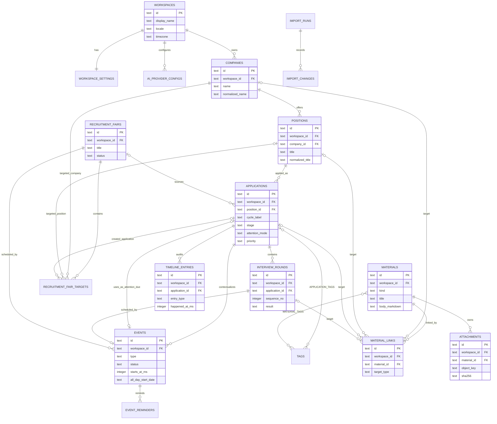
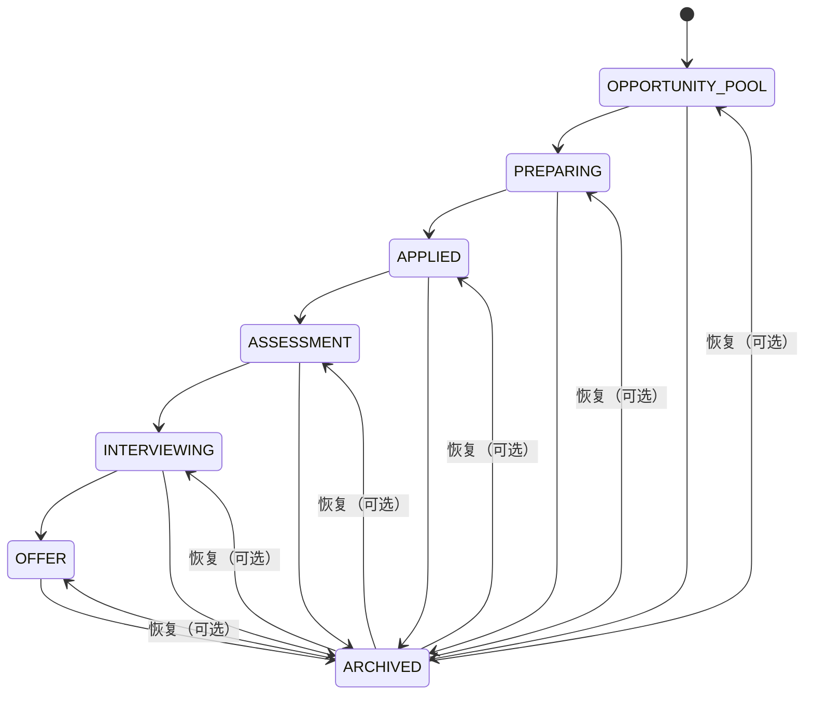
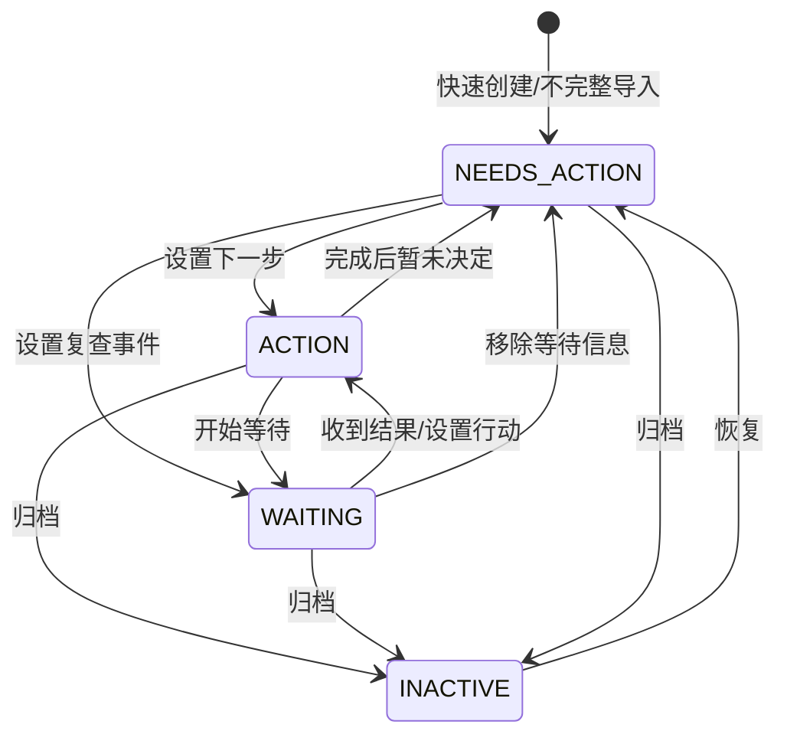

# 秋招进度板：数据模型

> 文档状态：已确认，可进入实现
> 存储：本地 SQLite/libSQL，由 Drizzle 管理 schema 与迁移
> 业务术语以 [GLOSSARY.md](GLOSSARY.md) 为准；导入/备份格式以 [IMPORT_EXPORT_SPEC.md](IMPORT_EXPORT_SPEC.md) 为准。

## 1. 建模原则

1. `Application`（岗位申请）是核心聚合；公司和岗位是可复用主数据，申请代表“公司 + 岗位 + 招聘批次”的一次尝试。
2. SQLite 是正式业务事实来源；搜索索引、今日列表、统计和阶段建议都是可重建投影。
3. 用户是阶段和结果的最终确认者。事件完成、面试结果和 AI 输出不能直接修改申请阶段。
4. 快速创建只要求公司和岗位。新申请以 `NEEDS_ACTION` 显式进入待补状态，而不是伪造下一步。
5. 所有多实体变更在事务内完成，并为申请追加不可编辑的时间线事实。
6. 删除与归档不同：归档是业务阶段；删除设置 `deleted_at_ms` 并进入 30 天回收站。
7. 数据库只保存附件对象键和元数据；二进制位于仓库外的受控目录。
8. API Key、浏览器离线草稿和生成到用户选择位置的分享文件不进入业务数据库。

## 2. 存储约定

### 2.1 标量与时间

| 概念 | SQLite 表示 | 规则 |
| --- | --- | --- |
| ID | `TEXT` | 应用生成 UUID；不可复用，不表达业务含义 |
| 时刻 | `INTEGER` | Unix epoch milliseconds，统一按 UTC 存储，字段后缀 `_at_ms` |
| 全天日期 | `TEXT` | ISO `YYYY-MM-DD`；结束日期使用 exclusive 语义 |
| 时区 | `TEXT` | IANA zone，例如 `Asia/Shanghai`；不能只保存 UTC offset |
| 布尔值 | `INTEGER` | 只允许 `0` 或 `1` |
| 枚举 | `TEXT` | 数据库存稳定代码值，界面中文从本地化资源解析 |
| JSON | `TEXT` | 只用于版本化 payload/快照；写入前做 schema 校验，不能替代常用查询列 |
| Markdown | `TEXT` | 富文本的规范持久化格式；展示时净化 |

### 2.2 通用列

除纯关联表和追加型审计/运维表外，业务实体包含：

| 字段 | 类型 | 说明 |
| --- | --- | --- |
| `id` | `TEXT PK` | UUID |
| `workspace_id` | `TEXT FK NOT NULL` | 指向本机单一工作区，为未来显式迁移保留隔离边界 |
| `created_at_ms` | `INTEGER NOT NULL` | 创建时刻 |
| `updated_at_ms` | `INTEGER NOT NULL` | 最近正式修改时刻 |
| `version` | `INTEGER NOT NULL DEFAULT 1` | 乐观并发版本，每次更新递增 |
| `deleted_at_ms` | `INTEGER NULL` | 非空表示进入回收站 |
| `delete_operation_id` | `TEXT NULL` | 同一次级联软删除共享的操作 ID，便于精确恢复 |

`created_at_ms <= updated_at_ms`、`version >= 1`。服务端必须覆盖时间和版本，不能接受客户端直接指定。示例数据另以 `is_sample` 标记，统计默认排除。

除 `workspaces`、以 `workspace_id` 自身为主键的 `workspace_settings` 和 Drizzle 自有迁移元数据外，所有业务、关联、审计与运维表都显式携带 `workspace_id`。所有可被引用的实体都对 `(workspace_id, id)` 建立唯一键；每个业务外键都以 `(workspace_id, foreign_id)` 复合引用父表的 `(workspace_id, id)`，多对多表也不例外。下文为可读性简写为“FK → `table.id`”，实现时不得降级成只引用 `id` 的单列外键。这样跨工作区关联在数据库层即失败，应用事务和一致性检查再做纵深验证。

### 2.3 文本规范化

`normalized_*` 字段由应用对用户文本执行 Unicode NFKC、首尾/连续空白归一化和大小写折叠后生成，仅用于匹配和索引；展示始终使用原文。未知或空字符串统一保存为 `NULL`，必填展示字段除外。

## 3. 关系总览

图中省略了通用审计列、复合 FK 的列对细节和部分运维表字段；以下定义为准。

## 4. 核心实体

### 4.1 `workspaces`

首版本只创建一行，但所有根实体都保留 `workspace_id`，禁止跨工作区关联。

| 字段 | 类型/可空 | 约束与含义 |
| --- | --- | --- |
| `id` | `TEXT NOT NULL` | PK |
| `display_name` | `TEXT NOT NULL` | 默认“我的秋招” |
| `locale` | `TEXT NOT NULL` | 默认 `zh-CN` |
| `timezone` | `TEXT NOT NULL` | 默认取系统 IANA 时区，首选 `Asia/Shanghai` |
| `created_at_ms` | `INTEGER NOT NULL` | 创建时刻 |
| `updated_at_ms` | `INTEGER NOT NULL` | 修改时刻 |
| `version` | `INTEGER NOT NULL` | 乐观版本 |

### 4.2 `workspace_settings`

| 字段 | 类型/可空 | 约束与含义 |
| --- | --- | --- |
| `workspace_id` | `TEXT NOT NULL` | PK、FK → `workspaces.id` |
| `theme` | `TEXT NOT NULL` | `SYSTEM` / `LIGHT` / `DARK` |
| `last_application_view` | `TEXT NOT NULL` | `BOARD` / `TABLE` |
| `week_starts_on` | `INTEGER NOT NULL` | `0..6`，默认 1 |
| `browser_notifications_enabled` | `INTEGER NOT NULL` | `0/1`；仅记录产品开关，不代表浏览器已授权 |
| `daily_backup_retention` | `INTEGER NOT NULL` | 默认 14，范围 `1..365` |
| `trash_retention_days` | `INTEGER NOT NULL` | 首版固定 30；变更需迁移/产品确认 |
| `onboarding_completed_at_ms` | `INTEGER NULL` | 首次引导完成或跳过时刻 |
| `created_at_ms` / `updated_at_ms` / `version` | `INTEGER` | 通用审计与乐观版本 |

### 4.3 `companies`

| 字段 | 类型/可空 | 约束与含义 |
| --- | --- | --- |
| 通用列 | 见 2.2 | 可软删除 |
| `name` | `TEXT NOT NULL` | 非空展示名称 |
| `normalized_name` | `TEXT NOT NULL` | 公司匹配键 |
| `website_url` | `TEXT NULL` | 允许 `http/https`，保存前校验 |
| `notes_markdown` | `TEXT NULL` | 公司级备注 |
| `is_sample` | `INTEGER NOT NULL` | `0/1`；示例数据标记 |

同一工作区内活动公司的 `normalized_name` 建立部分唯一索引。检测到同名时默认复用；用户确需两个实体时应先用可辨识展示名，而不是绕过约束。该部分唯一索引在回收站恢复时仍然生效；若名称已被新的活动公司占用，必须执行第 11.2 节的可见恢复计划，不能静默跳过或绕过唯一性。

### 4.4 `positions`

岗位是某公司下可复用的角色描述，申请通过 `position_id` 得到公司。

| 字段 | 类型/可空 | 约束与含义 |
| --- | --- | --- |
| 通用列 | 见 2.2 | 可软删除 |
| `company_id` | `TEXT NOT NULL` | FK → `companies.id`，`ON DELETE RESTRICT` |
| `title` | `TEXT NOT NULL` | 岗位名称 |
| `normalized_title` | `TEXT NOT NULL` | 匹配键 |
| `department` | `TEXT NULL` | 部门/业务线 |
| `location` | `TEXT NULL` | 城市或自由文本地点 |
| `work_mode` | `TEXT NOT NULL` | `UNSPECIFIED` / `ONSITE` / `HYBRID` / `REMOTE` |
| `job_url` | `TEXT NULL` | 当前岗位页；历史 JD 仍由资料快照保存 |
| `notes_markdown` | `TEXT NULL` | 岗位级备注 |
| `is_sample` | `INTEGER NOT NULL` | `0/1` |

同公司允许标题相同的多个岗位，避免因地区或业务线缺失而误合并；只建立非唯一匹配索引。

### 4.5 `applications`

| 字段 | 类型/可空 | 约束与含义 |
| --- | --- | --- |
| 通用列 | 见 2.2 | 核心聚合根，可软删除 |
| `position_id` | `TEXT NOT NULL` | FK → `positions.id`，`ON DELETE RESTRICT` |
| `cycle_label` | `TEXT NULL` | 招聘批次展示值 |
| `normalized_cycle_label` | `TEXT NULL` | 重复检测键；空值按统一哨兵参与查询，不写入展示 |
| `stage` | `TEXT NOT NULL` | `ApplicationStage`，默认 `OPPORTUNITY_POOL` |
| `priority` | `TEXT NOT NULL` | `HIGH` / `MEDIUM` / `LOW`，默认 `MEDIUM` |
| `source_kind` | `TEXT NOT NULL` | `ApplicationSource`，未填写时默认 `UNSPECIFIED` |
| `source_detail` | `TEXT NULL` | 自定义来源明细；仅 `CUSTOM` 使用且必须非空 |
| `source_url` | `TEXT NULL` | 原始来源链接 |
| `source_fair_id` | `TEXT NULL` | FK → `recruitment_fairs.id`；招聘会来源必须设置 |
| `attention_mode` | `TEXT NOT NULL` | `ACTION` / `WAITING` / `NEEDS_ACTION` / `INACTIVE` |
| `next_action_title` | `TEXT NULL` | `ACTION` 时非空；不是通用待办数组 |
| `current_action_event_id` | `TEXT NULL` | FK → `events.id`；仅 `ACTION` 可用，若存在须为本申请的 `ACTION_DUE` |
| `waiting_for` | `TEXT NULL` | 可选等待对象，如“HR 回复”；`WAITING` 的事实锚点是复查事件，不强迫用户填写此说明 |
| `waiting_review_event_id` | `TEXT NULL` | FK → `events.id`；仅 `WAITING` 可用且必填，须为本申请的 `FOLLOW_UP`；复查时刻/日期由该定时或全天事件提供 |
| `applied_at_ms` | `INTEGER NULL` | 用户确认的实际投递时间 |
| `offer_at_ms` | `INTEGER NULL` | 用户确认收到 Offer 的时间 |
| `archived_at_ms` | `INTEGER NULL` | 进入归档时间 |
| `archived_from_stage` | `TEXT NULL` | 归档前阶段；恢复界面的默认建议值，不是强制恢复目标；不得为 `ARCHIVED` |
| `archive_reason` | `TEXT NULL` | `ArchiveReason` |
| `archive_note` | `TEXT NULL` | `OTHER` 时必填，其余可选 |
| `notes_markdown` | `TEXT NULL` | 申请概览备注 |
| `last_activity_at_ms` | `INTEGER NOT NULL` | 用于排序；由关联业务变更更新 |
| `is_sample` | `INTEGER NOT NULL` | `0/1` |

attention 列使用完整真值表；“空”指 SQL `NULL`，必填文本还需经过规范化后非空：

| `attention_mode` | 阶段条件 | `next_action_title` | `current_action_event_id` | `waiting_for` | `waiting_review_event_id` |
| --- | --- | --- | --- | --- | --- |
| `ACTION` | `stage <> ARCHIVED` | 必填 | 可空；非空时须指向本申请的 `ACTION_DUE` | 空 | 空 |
| `WAITING` | `stage <> ARCHIVED` | 空 | 空 | 可空；非空时须为规范化后非空文本 | 必填；须指向本申请的 `FOLLOW_UP`，复查日期来自该事件 |
| `NEEDS_ACTION` | `stage <> ARCHIVED` | 空 | 空 | 空 | 空 |
| `INACTIVE` | `stage = ARCHIVED` | 空 | 空 | 空 | 空 |

因此 `stage=ARCHIVED` **当且仅当** `attention_mode=INACTIVE`；任一模式不适用的 attention 列都必须为空。`NEEDS_ACTION` 是快速创建/不完整导入后的显式风险状态。事件类型与同申请归属属于跨行条件，由应用服务在同一事务内校验，并由领域一致性检查复核。

归档列与阶段同样双向约束：`stage=ARCHIVED` 时 `archived_at_ms`、`archived_from_stage`、`archive_reason` 必填，`archived_from_stage` 不得为 `ARCHIVED`，且 `archive_reason=OTHER` 时 `archive_note` 必须为规范化后非空；非归档申请的四个归档列必须全部为空。恢复时用户可选择任一非 `ARCHIVED` 阶段，`archived_from_stage` 只负责预选默认值；提交恢复后四个归档列全部清空。

来源列也使用数据库 CHECK 与事务校验：

- 未填写来源保存为 `source_kind=UNSPECIFIED`，此时 `source_detail`、`source_fair_id` 均为空；空白输入和无法识别的导入枚举不是一回事，后者仍须在预览中确认映射。
- `source_kind=CUSTOM` 时 `source_detail` 必须为规范化后非空的明细，`source_fair_id` 必须为空。
- `source_kind=RECRUITMENT_FAIR` 时 `source_fair_id` 必填且须与申请同工作区，`source_detail` 必须为空。
- 其他内建来源的 `source_detail`、`source_fair_id` 均为空；`source_url` 可按实际来源独立填写。

“公司 + 岗位 + 招聘批次”只有**非唯一索引**。创建前查询并提示重复，但用户确认后允许继续创建。

### 4.6 `tags`、`application_tags`、`material_tags`

`tags`：

| 字段 | 类型/可空 | 约束与含义 |
| --- | --- | --- |
| 通用列 | 见 2.2 | 可软删除 |
| `name` | `TEXT NOT NULL` | 展示名称 |
| `normalized_name` | `TEXT NOT NULL` | 工作区内活动标签部分唯一 |
| `color_token` | `TEXT NULL` | 预定义视觉 token；状态含义不得只靠颜色 |

活动标签的 `(workspace_id, normalized_name)` 部分唯一索引在恢复时也不放宽。若同名活动标签已存在，必须让用户在“合并到现有标签”与“重命名后恢复”之间选择，并按第 11.2 节处理关联去重和时间线，不能静默丢弃旧关联。

关联表字段：

| 表 | 字段 | 约束 |
| --- | --- | --- |
| `application_tags` | `workspace_id`, `application_id`, `tag_id`, `created_at_ms` | PK `(workspace_id, application_id, tag_id)`；两个 `(workspace_id, …_id)` 复合 FK 均 `ON DELETE CASCADE` |
| `material_tags` | `workspace_id`, `material_id`, `tag_id`, `created_at_ms` | PK `(workspace_id, material_id, tag_id)`；两个 `(workspace_id, …_id)` 复合 FK 均 `ON DELETE CASCADE` |

两个关联表都对 `(workspace_id, id)` 形式的父键做真实复合外键校验，不能仅靠分别存在的单列 FK 或应用层检查来推断同工作区。

## 5. 日程、面试与招聘会

### 5.1 `events`

所有有时间意义的安排和截止使用同一实体。事件可以直接关联申请、面试轮次或招聘会；上下文必须符合下方按类型定义的严格互斥规则。

| 字段 | 类型/可空 | 约束与含义 |
| --- | --- | --- |
| 通用列 | 见 2.2 | 可软删除 |
| `application_id` | `TEXT NULL` | FK → `applications.id`，直接申请上下文 |
| `interview_round_id` | `TEXT NULL` | FK → `interview_rounds.id` |
| `recruitment_fair_id` | `TEXT NULL` | FK → `recruitment_fairs.id` |
| `type` | `TEXT NOT NULL` | `EventType` |
| `title` | `TEXT NOT NULL` | 非空；日历可读标题 |
| `status` | `TEXT NOT NULL` | `SCHEDULED` / `COMPLETED` / `CANCELLED` |
| `is_all_day` | `INTEGER NOT NULL` | `0/1` |
| `starts_at_ms` | `INTEGER NULL` | 定时事件开始 UTC 毫秒；定时形态下必填 |
| `ends_at_ms` | `INTEGER NULL` | 定时事件结束；可空，空表示发生在 `starts_at_ms` 的点事件；非空时必须严格晚于开始 |
| `all_day_start_date` | `TEXT NULL` | 全天事件开始日期 |
| `all_day_end_date_exclusive` | `TEXT NULL` | 全天事件 exclusive 结束日期 |
| `timezone` | `TEXT NOT NULL` | 事件解释时区 |
| `location` | `TEXT NULL` | 线下地点 |
| `meeting_url` | `TEXT NULL` | 线上会议/活动链接 |
| `notes_markdown` | `TEXT NULL` | 非敏感日程说明；ICS 仍需单独预览 |
| `is_hard_deadline` | `INTEGER NOT NULL` | `0/1`，影响今日风险排序 |
| `completed_at_ms` | `INTEGER NULL` | 完成时间，仅 `COMPLETED` |
| `ics_uid` | `TEXT NOT NULL` | 创建时生成且永不改变，工作区内唯一 |
| `is_sample` | `INTEGER NOT NULL` | `0/1` |

时间形态必须二选一：

- 定时：`is_all_day=0`，`starts_at_ms` 必填，`ends_at_ms` 可空，两个全天日期为空；`ends_at_ms IS NULL` 表示点事件，非空时必须满足 `ends_at_ms > starts_at_ms`；
- 全天：`is_all_day=1`，使用两个 ISO 日期，时刻为空，且 exclusive 结束日期晚于开始日期。

上下文与类型约束：

- `INTERVIEW` 的 `application_id` 与 `interview_round_id` **严格 XOR**，`recruitment_fair_id` 必须为空。M1 直接填写 `application_id`；M2 引入轮次后，新事件可以改为只填 `interview_round_id`，其申请通过轮次的 `application_id` 推导，事件行不得再重复保存。M1 已有的直接申请面试事件继续合法，不做强制迁移。
- `RECRUITMENT_FAIR` 必须且只能关联 `recruitment_fair_id`，另外两个上下文字段必须为空。
- `APPLICATION_DEADLINE`、`ACTION_DUE` 必须且只能直接关联 `application_id`。
- `FOLLOW_UP` 在 `application_id` 与 `recruitment_fair_id` 之间严格 XOR，`interview_round_id` 必须为空。申请等待复查使用前者；招聘会的会后跟进使用后者。M1 只创建直接关联申请的 `FOLLOW_UP`，招聘会关联形态是后续里程碑能力，但从 schema 起即为合法数据。
- `ASSESSMENT`、`WRITTEN_TEST` 可直接关联一个申请，也可暂时无上下文；不得关联轮次或招聘会。
- `OTHER` 可以无上下文，或只直接关联一个申请；不得关联轮次或招聘会。
- 同一面试轮次最多一个未删除的 `INTERVIEW` 主事件；同一招聘会最多一个未删除的 `RECRUITMENT_FAIR` 主事件。

所有上下文 FK 都是带 `workspace_id` 的复合 FK。应用服务还必须确认 `interview_round_id` 推导出的申请没有软删除且与操作上下文一致；这个推导关系用于 Today、提醒和归档过滤。

事件冲突是查询结果而非阻塞约束；只比较未删除、`SCHEDULED` 事件，保存时警告但允许用户确认。比较语义固定如下：

- 两个有结束时刻的定时事件按半开区间 `[start, end)` 判断重叠；首个事件的 `end` 等于另一个的 `start` 不冲突。
- 点事件与区间事件在 `interval.start <= point < interval.end` 时冲突；两个点事件仅在 `starts_at_ms` 为同一毫秒时冲突。
- 全天事件先按**该事件自己的 `timezone`**把开始日期 00:00 与 exclusive 结束日期 00:00 转成 UTC 边界，再与其他事件使用同一套半开区间/点规则比较。遇到夏令时必须按 IANA 时区的当地日期边界解析，不能假定一天恒为 24 小时。

### 5.2 `event_reminders`

| 字段 | 类型/可空 | 约束与含义 |
| --- | --- | --- |
| `id` | `TEXT PK` | UUID |
| `workspace_id` | `TEXT NOT NULL` | FK → `workspaces.id`；与 `event_id` 组成复合 FK 的工作区部分 |
| `event_id` | `TEXT NOT NULL` | `(workspace_id, event_id)` FK → `events(workspace_id, id)`，`ON DELETE CASCADE` |
| `offset_minutes` | `INTEGER NOT NULL` | `>= 0`，事件前多少分钟 |
| `in_app_enabled` | `INTEGER NOT NULL` | `0/1`；应用运行时的站内提醒 |
| `browser_enabled` | `INTEGER NOT NULL` | `0/1`；仅在浏览器能力和授权允许时尝试 |
| `include_in_ics` | `INTEGER NOT NULL` | `0/1`；导出为 ICS `VALARM`，不是本应用投递通道 |
| `last_in_app_fired_at_ms` | `INTEGER NULL` | 站内去重；不承诺应用关闭时必达 |
| `last_browser_fired_at_ms` | `INTEGER NULL` | 浏览器去重；不承诺后台必达 |
| `created_at_ms` / `updated_at_ms` | `INTEGER NOT NULL` | 审计时间 |

`(workspace_id, event_id, offset_minutes)` 唯一，三个启用位至少一个为 1。ICS 导出只读取 `include_in_ics=1` 的偏移并生成 `VALARM`，不会把系统日历的触发或完成状态回写到产品。

### 5.3 `interview_rounds`

| 字段 | 类型/可空 | 约束与含义 |
| --- | --- | --- |
| 通用列 | 见 2.2 | 归申请所有，可软删除 |
| `application_id` | `TEXT NOT NULL` | FK → `applications.id`，硬清除时 CASCADE |
| `sequence_no` | `INTEGER NOT NULL` | `>=1`；同申请活动轮次唯一 |
| `name` | `TEXT NOT NULL` | 自由名称，如“一面”“主管加面” |
| `kind` | `TEXT NOT NULL` | `TECHNICAL` / `HR` / `GROUP` / `MANAGER` / `OTHER` |
| `status` | `TEXT NOT NULL` | `PLANNED` / `SCHEDULED` / `COMPLETED` / `CANCELLED` |
| `result` | `TEXT NOT NULL` | `PENDING` / `PASSED` / `FAILED` / `WITHDRAWN` / `NO_DECISION` |
| `interviewer_names` | `TEXT NULL` | 自由文本，默认敏感 |
| `notes_markdown` | `TEXT NULL` | 简短轮次备注；完整复盘用 `INTERVIEW_NOTE` 资料 |
| `completed_at_ms` | `INTEGER NULL` | 完成时刻 |
| `is_sample` | `INTEGER NOT NULL` | `0/1` |

面试时间、地点和会议链接来自关联 `INTERVIEW` 事件，不能在轮次表重复保存。轮次是 M2 能力；它可以接管新建面试事件的上下文，但 M1 直接关联申请的历史事件无需回填轮次。记录结果只追加时间线并产生可忽略建议，不修改申请阶段。把轮次状态改为 `CANCELLED` 也**不会**自动取消、完成、改期或删除其 `INTERVIEW` 事件；若事件也要变化，必须由用户明确执行独立事件操作。

软删除轮次时，应用先在写事务中读取并检查该轮次至多一个未删除的 `INTERVIEW` 主事件。默认在同一事务中保留该事件及其提醒/历史，把事件的 `interview_round_id` 清空并将 `application_id` 设置为轮次所属申请，使上下文从“只关联轮次”原子改为“只直接关联申请”，整个过程始终满足严格 XOR。用户也可以在确认界面明确选择“同时删除面试事件”；此时事件与轮次使用同一 `delete_operation_id` 软删除，提醒行仍随事件保留到永久清除，以支持整组恢复。若发现多个主事件、跨工作区关系或目标申请已软删除，事务必须失败并交给一致性修复，不能猜测处理。

### 5.4 `recruitment_fairs`

| 字段 | 类型/可空 | 约束与含义 |
| --- | --- | --- |
| 通用列 | 见 2.2 | 独立根实体，可软删除 |
| `title` | `TEXT NOT NULL` | 招聘会名称 |
| `organizer` | `TEXT NULL` | 主办方 |
| `status` | `TEXT NOT NULL` | `PLANNED` / `ATTENDED` / `SKIPPED` / `CANCELLED` |
| `source_url` | `TEXT NULL` | 招聘会页面 |
| `onsite_notes_markdown` | `TEXT NULL` | 现场笔记 |
| `post_fair_notes_markdown` | `TEXT NULL` | 会后复盘 |
| `follow_up_text` | `TEXT NULL` | 招聘会级会后行动 |
| `follow_up_event_id` | `TEXT NULL` | FK → 本招聘会的 `FOLLOW_UP` 事件 |
| `follow_up_status` | `TEXT NOT NULL` | `NOT_SET` / `PENDING` / `DONE` / `NOT_NEEDED` |
| `is_sample` | `INTEGER NOT NULL` | `0/1` |

招聘会的时间、地点和链接以其 `RECRUITMENT_FAIR` 事件为准。`follow_up_event_id` 非空时必须指向未软删除、同工作区、只关联本招聘会且类型为 `FOLLOW_UP` 的事件；M1 不创建这种招聘会级跟进事件。`ATTENDED` 不自动创建申请。

### 5.5 `recruitment_fair_targets`

| 字段 | 类型/可空 | 约束与含义 |
| --- | --- | --- |
| `id` | `TEXT PK` | UUID |
| `workspace_id` | `TEXT NOT NULL` | FK → `workspaces.id` |
| `recruitment_fair_id` | `TEXT NOT NULL` | `(workspace_id, recruitment_fair_id)` 复合 FK → `recruitment_fairs`，CASCADE |
| `company_id` | `TEXT NOT NULL` | `(workspace_id, company_id)` 复合 FK → `companies` |
| `position_id` | `TEXT NULL` | `(workspace_id, position_id)` 复合 FK → `positions`；若有必须属于同一公司 |
| `target_role_text` | `TEXT NULL` | 尚未建正式岗位时的现场目标文本 |
| `application_id` | `TEXT NULL` | `(workspace_id, application_id)` 复合 FK → `applications`；从目标创建后的关联 |
| `interest_priority` | `TEXT NOT NULL` | `HIGH` / `MEDIUM` / `LOW` |
| `onsite_status` | `TEXT NOT NULL` | `NOT_CONTACTED` / `CONTACTED` / `FOLLOW_UP_NEEDED` / `NOT_INTERESTED`，默认 `NOT_CONTACTED` |
| `notes_markdown` | `TEXT NULL` | 准备/现场信息 |
| `follow_up_text` | `TEXT NULL` | 此目标的会后行动 |
| `follow_up_status` | `TEXT NOT NULL` | `NOT_SET` / `PENDING` / `DONE` / `NOT_NEEDED` |
| `created_at_ms` / `updated_at_ms` / `version` | `INTEGER` | 审计与并发 |

同招聘会内相同 `company_id + position_id/target_role_text` 提示重复，但允许确认保留。`onsite_status` 是现场接触事实，`follow_up_status` 是会后行动执行状态，二者独立且都不得自动改写另一个；`FOLLOW_UP_NEEDED` 只让 UI 高亮缺少/未完成的会后行动。

## 6. 资料与附件

### 6.1 `materials`

| 字段 | 类型/可空 | 约束与含义 |
| --- | --- | --- |
| 通用列 | 见 2.2 | 可软删除 |
| `kind` | `TEXT NOT NULL` | `JD_SNAPSHOT` / `EXTERNAL_RESOURCE` / `INTERVIEW_NOTE` |
| `title` | `TEXT NOT NULL` | 所有资料类型均必填，规范化后不得为空 |
| `body_markdown` | `TEXT NULL` | 规范正文；富文本编辑器读写 Markdown |
| `source_url` | `TEXT NULL` | 外部来源 URL |
| `source_title` | `TEXT NULL` | 原网页标题/来源名 |
| `source_summary` | `TEXT NULL` | 用户编写或确认的摘要 |
| `captured_at_ms` | `INTEGER NULL` | 快照/采集时间 |
| `supersedes_material_id` | `TEXT NULL` | FK → 旧资料；JD 更新创建新快照链 |
| `is_sensitive` | `INTEGER NOT NULL` | `INTERVIEW_NOTE` 默认 1；分享默认排除 |
| `is_sample` | `INTEGER NOT NULL` | `0/1` |

类型校验由数据库可表达的 CHECK 与创建/更新事务共同执行：

- `JD_SNAPSHOT` 的 `body_markdown` 必须为规范化后非空正文；一经确认不覆盖原快照，岗位描述变化时新增资料并通过 `supersedes_material_id` 连接。
- `EXTERNAL_RESOURCE` 的 `source_url` 与规范化后非空的 `body_markdown` 至少存在一项。
- `INTERVIEW_NOTE` 的 `body_markdown` 必须为规范化后非空正文，并且至少有一个指向未软删除、同工作区面试轮次的 `INTERVIEW_ROUND` link；其他资料类型不得伪装成轮次复盘来绕过该约束。

### 6.2 `material_links`

资料可同时关联多个上下文，每行必须且只能指向一种目标。

| 字段 | 类型/可空 | 约束与含义 |
| --- | --- | --- |
| `id` | `TEXT PK` | UUID |
| `workspace_id` | `TEXT NOT NULL` | FK → `workspaces.id`；参与本行全部复合 FK |
| `material_id` | `TEXT NOT NULL` | `(workspace_id, material_id)` 复合 FK → `materials`，CASCADE |
| `target_type` | `TEXT NOT NULL` | `COMPANY` / `POSITION` / `APPLICATION` / `INTERVIEW_ROUND` |
| `company_id` | `TEXT NULL` | `(workspace_id, company_id)` 复合 FK → `companies` |
| `position_id` | `TEXT NULL` | `(workspace_id, position_id)` 复合 FK → `positions` |
| `application_id` | `TEXT NULL` | `(workspace_id, application_id)` 复合 FK → `applications` |
| `interview_round_id` | `TEXT NULL` | `(workspace_id, interview_round_id)` 复合 FK → `interview_rounds` |
| `created_at_ms` | `INTEGER NOT NULL` | 关联时刻 |

CHECK 保证四个目标 FK 恰有一个非空且与 `target_type` 一致。分别建立四个部分唯一索引，例如 `(workspace_id, material_id, company_id) WHERE target_type='COMPANY'`，确保同一资料不会重复链接同一目标。一个资料至少有一个有效链接，由创建事务保证。目标软删除后链接保留，以便回收站恢复；目标硬清除时删除链接，若资料失去全部链接，则连同附件进入同一次永久清理。

### 6.3 `attachments`

附件只能归属于一个 `material`；schema 不提供指向申请、事件或面试轮次的附件 FK。轮次相关图片/PDF 必须先创建 `INTERVIEW_NOTE`，由该资料链接轮次，再把附件挂到该资料。

| 字段 | 类型/可空 | 约束与含义 |
| --- | --- | --- |
| 通用列 | 见 2.2 | 可软删除 |
| `material_id` | `TEXT NOT NULL` | FK → `materials.id`，硬清除时 CASCADE |
| `object_key` | `TEXT NOT NULL` | 带规范小写扩展名的完整相对文件名，如 `<uuid>.pdf`；工作区唯一，不含目录分隔符或用户路径 |
| `original_name` | `TEXT NOT NULL` | 仅展示，经过长度/控制字符处理 |
| `media_type` | `TEXT NOT NULL` | `IMAGE` / `PDF` |
| `mime_type` | `TEXT NOT NULL` | 内容检测后的允许 MIME |
| `extension` | `TEXT NOT NULL` | 从 `object_key` 与内容检测共同派生/校验的规范小写扩展名，不参与拼接最终文件名 |
| `size_bytes` | `INTEGER NOT NULL` | `>0`，受上传上限约束 |
| `sha256` | `TEXT NOT NULL` | 64 位小写十六进制，用于备份校验 |
| `width_px` / `height_px` | `INTEGER NULL` | 图片可选元数据 |
| `page_count` | `INTEGER NULL` | PDF 可选元数据 |

`object_key` 采用受控 basename 语法（建议 UUID 加允许扩展名），规范形式本身已包含最终扩展名；禁止 `/`、`\`、`..`、绝对路径和大小写不规范扩展。所有组件都只按记录所属 generation 下的 `stores/<generation_id>/attachments/<object_key>` 定位对象，不能再次附加 `extension`。`UNIQUE(workspace_id, object_key)` 是强制约束；对象落盘同样必须采用“目标存在即失败”的 no-replace 语义，绝不覆盖已有文件。数据库提交不代表可以省略文件校验。读取、备份和 GC 必须重新确保解析后的绝对路径仍位于该 generation 的 `attachments` 根目录；缺失或哈希不符进入一致性错误，不静默忽略。

#### 6.3.1 附件写入协议与崩溃恢复

创建附件严格按以下顺序执行，不能先登记数据库再落盘：

1. 在**数据根**的受控 `tmp/uploads/` 目录以 `CREATE_NEW` 创建随机 `.part` 文件；流式写入时限制大小并计算 SHA-256。不得使用 `attachments/.tmp`，也不得把生成过程的临时文件放入 `attachments/`。
2. 对临时文件执行 `fsync`，再按 magic bytes/安全解析器校验实际 MIME、扩展名、图片尺寸或 PDF 页数；校验失败立即关闭并删除临时文件。
3. 生成不可预测、工作区唯一且已带规范小写扩展名的 `object_key`，确认最终路径严格为当前 generation 下的 `stores/<generation_id>/attachments/<object_key>`；使用当前 Windows/Node 版本验证过的**原子且 no-replace**移动原语把临时文件移到该最终位置，并同步文件及目录元数据。目标已存在时整个操作失败并换新键重试，禁止覆盖。
4. 文件稳定落盘后，才在数据库事务中插入 `attachments` 行及相应时间线/outbox 记录。事务失败不回滚文件系统，而是留下可识别的未登记对象供安全清理。

各崩溃点的可解释残留与处理：

| 崩溃位置 | 可能残留 | 恢复规则 |
| --- | --- | --- |
| 临时写入或校验前后 | `tmp/uploads/*.part` | 不进入业务查询；mtime 超过 24 小时且无活动句柄后才可清理 |
| 校验完成、原子移动前 | 已校验临时文件 | 同上；重启不尝试猜测并续接旧事务 |
| 原子移动后、DB 提交前或事务回滚 | 当前 generation 最终目录中的未登记对象 | 在 maintenance gate 下确认无 `(workspace_id, object_key)` 记录后，首次扫描只原子写入带当前 `generation_id` 的 `PENDING` `file_gc_jobs` 与同到期时间的 outbox 标记，`available_at_ms` 至少延后 24 小时；执行时二次确认仍无登记才删除 |
| DB 提交后 | 文件与行均存在 | 正常状态；启动检查验证路径、大小和 SHA-256 |

临时文件扫描和最终目录孤儿扫描都只能在第 12.3 节 maintenance gate 下运行。安全清理不得仅凭文件名或一次目录扫描直接删除。任何路径越界、哈希与预期冲突或时间戳异常的对象进入人工可见的隔离错误，不自动清除。

## 7. 审计、草稿与运维实体

### 7.1 `timeline_entries`

申请时间线是 append-only 审计事实，用户不能直接编辑或删除单条记录。

| 字段 | 类型/可空 | 约束与含义 |
| --- | --- | --- |
| `id` | `TEXT PK` | UUID |
| `workspace_id` | `TEXT NOT NULL` | FK → `workspaces.id` |
| `application_id` | `TEXT NOT NULL` | `(workspace_id, application_id)` 复合 FK → `applications`，永久清除时 CASCADE |
| `entry_type` | `TEXT NOT NULL` | `TimelineEntryType` |
| `actor_kind` | `TEXT NOT NULL` | `USER` / `SYSTEM` / `IMPORT` |
| `happened_at_ms` | `INTEGER NOT NULL` | 事实发生时刻，可不同于写入时刻 |
| `summary` | `TEXT NOT NULL` | 简短人类可读摘要，不存秘密 |
| `details_json` | `TEXT NULL` | 版本化最小差异，如阶段 before/after；不复制 JD 全文 |
| `source_entity_type` | `TEXT NULL` | `EVENT` / `INTERVIEW_ROUND` / `MATERIAL` / `IMPORT_RUN` 等 |
| `source_entity_id` | `TEXT NULL` | 逻辑来源 ID；允许来源日后被永久清理 |
| `correlation_id` | `TEXT NOT NULL` | 同一用例的关联 ID |
| `reverts_entry_id` | `TEXT NULL` | 与 `workspace_id` 组成自引用复合 FK → 被撤销条目；撤销本身是新条目 |
| `created_at_ms` | `INTEGER NOT NULL` | 实际写入时刻 |

关键类型至少包括：`APPLICATION_CREATED`、`STAGE_CHANGED`、`STAGE_CHANGE_REVERTED`、`ATTENTION_CHANGED`、`EVENT_CREATED`、`EVENT_RESCHEDULED`、`EVENT_COMPLETED`、`EVENT_CANCELLED`、`INTERVIEW_RESULT_RECORDED`、`MATERIAL_LINKED`、`ARCHIVED`、`RESTORED`、`COMPANY_MERGED_ON_RESTORE`、`TAG_MERGED_ON_RESTORE`、`IMPORTED`、`DELETED`。

### 7.2 `capture_drafts`（`CaptureDraft`）

| 字段 | 类型/可空 | 约束与含义 |
| --- | --- | --- |
| 通用列 | 见 2.2 | 可软删除 |
| `kind` | `TEXT NOT NULL` | `APPLICATION_CAPTURE` / `MATERIAL_NOTE` / `INTERVIEW_NOTE` |
| `raw_text` | `TEXT NULL` | 用户粘贴/输入内容 |
| `source_url` | `TEXT NULL` | 可选来源 |
| `parsed_payload_json` | `TEXT NULL` | 经版本化 schema 验证的字段建议 |
| `parser_kind` | `TEXT NOT NULL` | `NONE` / `RULE` / `AI` |
| `status` | `TEXT NOT NULL` | `ACTIVE` / `CONFIRMED` / `DISCARDED` |
| `confirmed_entity_type` | `TEXT NULL` | 确认写入后的根实体类型 |
| `confirmed_entity_id` | `TEXT NULL` | 对应实体 ID |
| `last_saved_at_ms` | `INTEGER NOT NULL` | 草稿恢复排序 |

这里的术语必须严格区分：

- `CaptureDraft` 是本节 SQLite 表中的业务采集草稿，可包含规则/AI 解析建议，并进入备份与正式数据生命周期。
- `EditorRecoveryDraft` 是 IndexedDB 中针对当前编辑器的短期崩溃恢复快照，不代表一个业务草稿，不同步进本表。每个编辑器实例使用独立 `draftId` 和递增 `revision`；删除必须核对修订号，正式保存只批量清理内容与数据库版本相同的候选，其他不同候选仅在用户明确放弃后清除。
- `OfflineCaptureDraft` 是 IndexedDB 中离线创建、等待同步确认的采集草稿；恢复连接后必须先由用户确认，才转换为一个新的 `CaptureDraft` 或直接提交正式实体，不能与同 ID 的 SQLite 行双写。

AI 只生成 `CaptureDraft` 建议。`CONFIRMED` 必须来自用户确认用例，随后写正式实体和时间线。三个类型不得在代码、埋点、导入/备份 manifest 或界面文案中统称为同一个“draft”。

### 7.3 `ai_provider_configs`

| 字段 | 类型/可空 | 约束与含义 |
| --- | --- | --- |
| 通用列 | 见 2.2 | 可软删除 |
| `display_name` | `TEXT NOT NULL` | 用户可识别名称 |
| `provider_kind` | `TEXT NOT NULL` | 首版 `OPENAI_COMPATIBLE` |
| `endpoint_url` | `TEXT NOT NULL` | HTTPS；显式 loopback 开发地址例外 |
| `model_name` | `TEXT NOT NULL` | 发送给适配器的模型标识 |
| `credential_target` | `TEXT NOT NULL` | Windows Credential Manager 查找键，不是 API Key |
| `enabled` | `INTEGER NOT NULL` | `0/1`；同一工作区至多一个活动配置 |

### 7.4 `import_runs` 与 `import_changes`

`import_runs`：

| 字段 | 类型/可空 | 约束与含义 |
| --- | --- | --- |
| `id` / `workspace_id` | `TEXT NOT NULL` | PK 与工作区 FK |
| `format` | `TEXT NOT NULL` | `CSV` / `XLSX` / `BACKUP` |
| `source_basename` | `TEXT NULL` | 只存基础名，不存绝对路径 |
| `source_sha256` | `TEXT NOT NULL` | 导入源标识 |
| `mapping_json` | `TEXT NULL` | 已确认列映射及格式版本 |
| `status` | `TEXT NOT NULL` | `PREVIEWED` / `APPLIED` / `ROLLED_BACK` / `FAILED` |
| `total_rows` / `created_rows` / `updated_rows` / `skipped_rows` | `INTEGER NOT NULL` | 均 `>=0` |
| `error_summary_json` | `TEXT NULL` | 脱敏错误计数，不保存原始行 |
| `created_at_ms` / `applied_at_ms` / `rolled_back_at_ms` | `INTEGER` | 生命周期时刻 |

`import_changes`：

| 字段 | 类型/可空 | 约束与含义 |
| --- | --- | --- |
| `id` | `TEXT PK` | UUID |
| `workspace_id` | `TEXT NOT NULL` | FK → `workspaces.id`；参与复合 FK |
| `import_run_id` | `TEXT NOT NULL` | `(workspace_id, import_run_id)` 复合 FK → `import_runs`，CASCADE |
| `sequence_no` | `INTEGER NOT NULL` | 批次内顺序，唯一 |
| `entity_type` / `entity_id` | `TEXT NOT NULL` | 受控实体类型与 ID |
| `operation` | `TEXT NOT NULL` | `INSERT` / `UPDATE` |
| `before_json` | `TEXT NULL` | UPDATE 撤销所需的最小、版本化快照 |
| `after_version` | `INTEGER NOT NULL` | 防止撤销覆盖导入后用户的新修改 |
| `created_at_ms` | `INTEGER NOT NULL` | 记录时刻 |

确认导入在单事务内写入业务记录、`import_run`、changes 和时间线。当前会话撤销只有在目标仍处于 `after_version` 时自动执行；已有后续编辑时必须提示冲突，不能静默覆盖。

### 7.5 `backup_runs`

| 字段 | 类型/可空 | 约束与含义 |
| --- | --- | --- |
| `id` / `workspace_id` | `TEXT NOT NULL` | PK 与工作区 FK |
| `kind` | `TEXT NOT NULL` | `DAILY` / `MANUAL` / `PRE_UPDATE` / `PRE_RESTORE` |
| `file_basename` | `TEXT NOT NULL` | 受控目录内基础名，不存任意路径 |
| `format_version` | `INTEGER NOT NULL` | ZIP 协议版本 |
| `schema_version` | `TEXT NOT NULL` | 导出时最后应用迁移 ID |
| `app_version` | `TEXT NOT NULL` | 应用版本 |
| `is_encrypted` | `INTEGER NOT NULL` | `0/1` |
| `sha256` | `TEXT NULL` | 成功完成后必填 |
| `attachment_count` | `INTEGER NULL` | 成功完成后必填 |
| `status` | `TEXT NOT NULL` | `RUNNING` / `SUCCEEDED` / `FAILED` / `PRUNED` |
| `error_code` | `TEXT NULL` | 脱敏稳定错误码 |
| `created_at_ms` / `completed_at_ms` | `INTEGER` | 生命周期时刻 |

密码和密钥绝不保存。备份文件被轮换清理后把状态改为 `PRUNED`，保留最小审计，不伪装为仍可恢复。

### 7.6 `file_gc_jobs`

数据库提交与物理文件删除不能成为一个原子事务，因此永久清除和孤儿清理使用耐久作业表：

| 字段 | 类型/可空 | 约束与含义 |
| --- | --- | --- |
| `id` | `TEXT PK` | UUID，并对 `(workspace_id, id)` 建唯一键 |
| `workspace_id` | `TEXT NOT NULL` | FK → `workspaces.id` |
| `generation_id` | `TEXT NOT NULL` | 创建任务时由受信任运行时写入的受限 ID；与 `object_key` 一起固定物理对象所属 generation，不接受浏览器输入 |
| `attachment_id` | `TEXT NULL` | 原附件逻辑 ID，仅用于诊断；附件行可已删除，故不建 FK |
| `object_key` | `TEXT NOT NULL` | 带规范小写扩展名的完整相对文件名；`UNIQUE(generation_id, object_key)`，对象键在同一 generation 内永不复用 |
| `expected_sha256` | `TEXT NOT NULL` | 调度前确认的文件哈希；删除前再次校验 |
| `reason` | `TEXT NOT NULL` | `PERMANENT_DELETE` / `UNREGISTERED_ORPHAN` |
| `status` | `TEXT NOT NULL` | `PENDING` / `PROCESSING` / `SUCCEEDED` / `DEAD` / `QUARANTINED` |
| `attempt_count` | `INTEGER NOT NULL` | 默认 0，`>=0` |
| `available_at_ms` | `INTEGER NOT NULL` | 下次可执行时间；承载安全等待与退避 |
| `lease_owner` | `TEXT NULL` | 当前 worker 随机实例 ID |
| `lease_expires_at_ms` | `INTEGER NULL` | 崩溃后允许其他 worker 重新领取 |
| `last_error_code` | `TEXT NULL` | 稳定、脱敏错误码 |
| `created_at_ms` / `updated_at_ms` / `completed_at_ms` | `INTEGER` | 生命周期时刻 |

永久清除在**同一数据库事务**内先固定 `generation_id + object_key + expected_sha256` 清单、插入 `file_gc_jobs` 与对应 outbox，再删除附件/业务行；提交后 worker 才接触文件系统。worker 不依赖已删除的附件行、原文件名、当前 active 指针或 `extension` 猜路径，只把任务中的受限 `generation_id` 与已校验的 `object_key` 解析为 `stores/<generation_id>/attachments/<object_key>`。作业采用至少一次执行：文件已不存在视为幂等成功；路径越界或实际 SHA-256 不匹配时不得删除，转为 `QUARANTINED`；瞬时失败指数退避并增加随机抖动，超过限定次数转 `DEAD`，允许用户重试。`UNREGISTERED_ORPHAN` 在首次确认时记录当时计算的 SHA-256，`available_at_ms` 不得早于首次扫描后 24 小时；到期领取后须在 gate 内二次确认数据库仍无登记且哈希未变化。更新复制 generation 时，helper 必须在服务停止且持有维护锁的条件下，把候选库内所有未完成 GC 作业的 `generation_id` 重绑定为候选 ID，并将遗留 `PROCESSING` 租约安全重置为可重试状态；已完成历史作业不得再次调度。恢复包不包含 GC 作业，因此恢复生成的候选库从空作业队列开始。

### 7.7 `outbox`

outbox 持久化数据库事务提交后的本地副作用意图，例如 `FILE_GC_REQUESTED`、`FTS_REBUILD_REQUESTED` 和应用在线时的 `REMINDER_DUE`；它不是云端消息队列，也不承诺应用关闭时投递浏览器通知。

| 字段 | 类型/可空 | 约束与含义 |
| --- | --- | --- |
| `id` | `TEXT PK` | UUID，并对 `(workspace_id, id)` 建唯一键 |
| `workspace_id` | `TEXT NOT NULL` | FK → `workspaces.id` |
| `topic` | `TEXT NOT NULL` | 受控 `OutboxTopic` |
| `aggregate_type` / `aggregate_id` | `TEXT NULL` | 逻辑关联；可指向同事务中将被永久清除的实体，因此不建物理 FK |
| `payload_json` | `TEXT NOT NULL` | 经版本化 schema 校验的最小 payload；不含秘密或绝对路径 |
| `idempotency_key` | `TEXT NOT NULL` | `UNIQUE(workspace_id, idempotency_key)` |
| `status` | `TEXT NOT NULL` | `PENDING` / `PROCESSING` / `SUCCEEDED` / `DEAD` |
| `attempt_count` | `INTEGER NOT NULL` | 默认 0，`>=0` |
| `available_at_ms` | `INTEGER NOT NULL` | 下次可领取时刻 |
| `lease_owner` / `lease_expires_at_ms` | `TEXT` / `INTEGER NULL` | 比较并交换领取；过期后可重试 |
| `last_error_code` | `TEXT NULL` | 稳定、脱敏错误码 |
| `created_at_ms` / `updated_at_ms` / `processed_at_ms` | `INTEGER` | 生命周期时刻 |

业务事务必须把领域变更、时间线和 outbox 行原子提交，禁止“提交后再尽力写队列”。worker 通过条件更新领取一行，以 `idempotency_key` 实现幂等、按至少一次语义处理，并在失败时指数退避加抖动；`DEAD` 保留供诊断和显式重试。`FILE_GC_REQUESTED` 的 payload 只携带 `file_gc_job_id`，实际对象键与哈希以 `file_gc_jobs` 为事实来源。所有 worker 在运行前都要获取第 12 节的 maintenance gate；拿不到就不计失败次数地延后。

### 7.8 Drizzle 迁移元数据

Drizzle 的迁移记录表由迁移工具拥有，业务代码只读最后应用迁移标识用于健康检查和备份 manifest。不得再维护一个可与其分叉的“当前 schema 版本”业务字段。迁移 SQL 与快照位于 Git 仓库；运行记录位于用户数据库。

## 8. 枚举清单

| 枚举 | 稳定代码值 |
| --- | --- |
| `ApplicationStage` | `OPPORTUNITY_POOL`, `PREPARING`, `APPLIED`, `ASSESSMENT`, `INTERVIEWING`, `OFFER`, `ARCHIVED` |
| `Priority` | `HIGH`, `MEDIUM`, `LOW` |
| `AttentionMode` | `ACTION`, `WAITING`, `NEEDS_ACTION`, `INACTIVE` |
| `ArchiveReason` | `REJECTED`, `ABANDONED`, `WITHDRAWN`, `OTHER` |
| `ApplicationSource` | `UNSPECIFIED`, `OFFICIAL_SITE`, `JOB_PLATFORM`, `REFERRAL`, `RECRUITMENT_FAIR`, `CAMPUS_CHANNEL`, `CUSTOM` |
| `EventType` | `INTERVIEW`, `ASSESSMENT`, `WRITTEN_TEST`, `RECRUITMENT_FAIR`, `APPLICATION_DEADLINE`, `ACTION_DUE`, `FOLLOW_UP`, `OTHER` |
| `EventStatus` | `SCHEDULED`, `COMPLETED`, `CANCELLED` |
| `InterviewKind` | `TECHNICAL`, `HR`, `GROUP`, `MANAGER`, `OTHER` |
| `InterviewStatus` | `PLANNED`, `SCHEDULED`, `COMPLETED`, `CANCELLED` |
| `InterviewResult` | `PENDING`, `PASSED`, `FAILED`, `WITHDRAWN`, `NO_DECISION` |
| `RecruitmentFairStatus` | `PLANNED`, `ATTENDED`, `SKIPPED`, `CANCELLED` |
| `FairTargetOnsiteStatus` | `NOT_CONTACTED`, `CONTACTED`, `FOLLOW_UP_NEEDED`, `NOT_INTERESTED` |
| `FollowUpStatus` | `NOT_SET`, `PENDING`, `DONE`, `NOT_NEEDED` |
| `MaterialKind` | `JD_SNAPSHOT`, `EXTERNAL_RESOURCE`, `INTERVIEW_NOTE` |
| `AttachmentMediaType` | `IMAGE`, `PDF` |
| `FileGcReason` | `PERMANENT_DELETE`, `UNREGISTERED_ORPHAN` |
| `FileGcStatus` | `PENDING`, `PROCESSING`, `SUCCEEDED`, `DEAD`, `QUARANTINED` |
| `OutboxTopic` | `FILE_GC_REQUESTED`, `FTS_REBUILD_REQUESTED`, `REMINDER_DUE` |
| `OutboxStatus` | `PENDING`, `PROCESSING`, `SUCCEEDED`, `DEAD` |

未知枚举值在备份恢复/导入预览中必须进入兼容映射，不能静默改成默认值。数据库使用 CHECK 或引用枚举表约束稳定代码；中文显示名不入库。

## 9. 状态机与业务不变量

### 9.1 申请阶段

图表示常见路径，不是强制单向工作流：用户可以在任意非归档阶段之间手动纠正或跳转。每次变化都写时间线；只有用户用例可改变 `stage`。进入归档要满足归档字段约束；恢复界面用 `archived_from_stage` 作为默认建议，但用户可以选择任一非 `ARCHIVED` 阶段，提交后清空归档字段。Offer 仍是活跃阶段。

### 9.2 行动模式

`NEEDS_ACTION` 是为了兼容低摩擦录入的显式、可查询状态，必须出现在“今日 > 缺少下一步”，不能长期被 UI 隐藏。行动和等待互斥，列级约束以第 4.5 节真值表为准。归档会清空 attention 列并进入 `INACTIVE`；恢复默认进入 `NEEDS_ACTION`，除非同一恢复事务中用户明确设置新的行动或等待，不复活旧 attention 指针。

### 9.3 事件、轮次与招聘会

- 事件：`SCHEDULED → COMPLETED | CANCELLED`；重新打开是显式用户操作并写时间线。
- 面试轮次：`PLANNED → SCHEDULED → COMPLETED`，任何未结束状态可 `CANCELLED`；结果与状态必须相容。
- 招聘会：`PLANNED → ATTENDED | SKIPPED | CANCELLED`；状态变化不创建申请。
- 任何上述状态变化都不得自动修改 `ApplicationStage`。
- 轮次改为 `CANCELLED` 不自动修改其面试事件；软删除轮次则按第 5.3 节由用户选择“默认保留并原子重挂事件”或“同操作软删除事件”。
- 归档申请不取消、不完成也不软删除其关联事件；事件是历史事实。其默认可见性由第 11.1 节按直接或轮次推导的申请上下文过滤。

## 10. 索引与搜索

必须建立的 B-tree/部分索引：

| 表 | 索引键 | 用途/唯一性 |
| --- | --- | --- |
| `companies` | `(workspace_id, normalized_name) WHERE deleted_at_ms IS NULL` | 活动公司唯一 |
| `positions` | `(workspace_id, company_id, normalized_title, location, deleted_at_ms)` | 岗位匹配，非唯一 |
| `applications` | `(workspace_id, stage, deleted_at_ms)` | 看板 |
| `applications` | `(workspace_id, attention_mode, deleted_at_ms)` | 今日待补/等待 |
| `applications` | `(workspace_id, position_id, normalized_cycle_label, deleted_at_ms)` | 重复警告，非唯一 |
| `applications` | `(workspace_id, priority, last_activity_at_ms)` | 表格排序 |
| `applications` | `(workspace_id, source_kind, source_fair_id)` | 渠道和招聘会追踪 |
| `applications` | `(workspace_id, current_action_event_id)`、`(workspace_id, waiting_review_event_id)` | attention 反查与一致性维护，非唯一 |
| `events` | `(workspace_id, status, starts_at_ms, deleted_at_ms)` | 日程与冲突 |
| `events` | `(workspace_id, all_day_start_date, deleted_at_ms)` | 全天日程 |
| `events` | `(workspace_id, application_id, type, deleted_at_ms)` | 直接申请日程 |
| `events` | `(workspace_id, recruitment_fair_id, type, deleted_at_ms)` | 招聘会主事件与会后跟进查询，非唯一 |
| `events` | `(workspace_id, ics_uid)` | 唯一，稳定 ICS UID |
| `events` | `(workspace_id, interview_round_id) WHERE type='INTERVIEW' AND deleted_at_ms IS NULL` | 面试轮次主事件部分唯一 |
| `events` | `(workspace_id, recruitment_fair_id) WHERE type='RECRUITMENT_FAIR' AND deleted_at_ms IS NULL` | 招聘会主事件部分唯一 |
| `event_reminders` | `(workspace_id, event_id, offset_minutes)` | 唯一提醒偏移 |
| `interview_rounds` | `(workspace_id, application_id, sequence_no) WHERE deleted_at_ms IS NULL` | 活动轮次唯一 |
| `recruitment_fair_targets` | `(workspace_id, recruitment_fair_id, onsite_status)` | 现场清单筛选 |
| `timeline_entries` | `(workspace_id, application_id, happened_at_ms DESC, id)` | 详情时间线稳定排序 |
| `import_changes` | `(workspace_id, import_run_id, sequence_no)` | 批次内唯一、按序撤销 |
| `materials` | `(workspace_id, kind, updated_at_ms, deleted_at_ms)` | 资料库筛选 |
| `application_tags` / `material_tags` | 第 4.6 节各自三列 PK | 同工作区内关系唯一 |
| `material_links` | `(workspace_id, material_id, 各目标 FK)` 的四个部分索引 | 上下文反查；同目标链接唯一 |
| `attachments` | `(workspace_id, object_key)` | 强制唯一；与文件系统 no-replace 对应 |
| `attachments` | `(workspace_id, sha256)` | 校验/可选去重，非唯一 |
| `file_gc_jobs` | `(workspace_id, status, available_at_ms)` | worker 领取；另有 `(generation_id, object_key)` 唯一约束 |
| `outbox` | `(workspace_id, status, available_at_ms)` | worker 领取；另有幂等键唯一约束 |
| 所有软删表 | `(workspace_id, deleted_at_ms)` | 回收站和到期清理 |

全文搜索为可重建派生结构：

- `application_fts`：公司名、岗位名、批次、申请备注、标签；
- `material_fts`：标题、Markdown 纯文本、来源标题和摘要；
- `fair_fts`：标题、主办方和笔记。

优先使用 SQLite FTS5 `trigram` tokenizer 支持中文子串搜索；启动时必须探测当前 libSQL 构建能力。若不可用，明确降级到规范化 `LIKE` 查询并保持结果正确，只允许性能下降。FTS 查询参数不得直接拼接为 SQL。

## 11. 软删除、归档与永久清除

### 11.1 查询规则

- 普通仓储默认追加 `deleted_at_ms IS NULL`；回收站使用独立查询入口。
- 归档申请没有 `deleted_at_ms`，只通过 `stage=ARCHIVED` 从主看板排除。
- 搜索、提醒和统计默认排除软删除；统计是否包含归档由用例明确指定。
- 事件查询定义一个不落库的 `resolved_application_id`：直接申请事件取 `events.application_id`，轮次面试事件取 `interview_rounds.application_id`。Today、即将到来列表以及提醒扫描/实际投递都必须排除 `resolved_application_id` 所指申请为 `ARCHIVED` 的事件；投递时再次检查，避免归档前已入 outbox 的提醒漏过过滤。
- 归档本身不改变关联事件的 `status`、时间或提醒配置。恢复后，仍为 `SCHEDULED` 且时间在当前时刻之后的直接/轮次事件按正常规则重新出现在 Today/提醒中；过去事件只保留为历史，不补发提醒。招聘会事件不因某个来源申请归档而隐藏。

### 11.2 级联软删除

- 删除申请时，以同一 `delete_operation_id` 标记其专属面试轮次、直接/轮次事件和不再被其他上下文引用的资料；共享公司、岗位、标签和资料不得误删。
- 单独软删除面试轮次不沿用“删除申请”的级联规则：默认在同一事务把其唯一活动 `INTERVIEW` 事件从 `interview_round_id` 原子重挂到轮次所属 `application_id`，保留事件、提醒和历史；只有用户明确勾选时，才让事件与轮次以同一 `delete_operation_id` 软删除。轮次状态改为 `CANCELLED` 则完全不触发这套删除流程。
- 删除公司前必须展示受影响岗位/申请；确认后在同一事务标记其拥有树。
- 删除资料时附件一同软删除，但物理文件保留到永久清除。
- 恢复只撤销同一操作 ID 所标记且尚未发生后续冲突的记录；缺失上级时先展示恢复计划。申请从业务归档恢复时的目标阶段选择遵循第 9.1 节，不受此软删除恢复规则限制。

公司与标签的活动名称部分唯一索引在恢复期间始终保留。若待恢复实体的 `normalized_name` 已被活动实体占用，恢复计划必须暂停并让用户明确选择：

- **重命名后恢复**：用户提供一个通过唯一性校验的新展示名，事务更新名称/规范化名称并恢复原拥有关系。
- **合并到现有实体**：待恢复重复实体本身保持软删除，关系改挂到用户选定的**同工作区**活动实体，不能仅把“恢复”标成成功却遗漏关系。

公司合并时，在同一事务把待恢复公司的岗位（连同通过岗位保留的申请关系）、`recruitment_fair_targets.company_id` 和公司型 `material_links` 重挂到目标公司；恢复同一删除操作中合格的子记录，并对重挂后重复的资料链接按唯一键合并。每个受影响申请追加 `COMPANY_MERGED_ON_RESTORE` 时间线，记录源/目标公司 ID 与被重挂关系计数。标签合并时，把 `application_tags`、`material_tags` 改挂到目标标签；若目标关系已存在则按三列 PK 去重而不是报错或重复插入，并为每个直接受影响的申请追加 `TAG_MERGED_ON_RESTORE` 时间线。所有这些变更、去重计数和时间线必须同事务提交；确认界面和结果摘要都要展示合并/重命名影响，禁止静默自动选择。

### 11.3 永久清除

满 30 天只是“可清理”，首版执行前仍需用户确认。数据库依赖采用：

- 专属子实体（轮次、提醒、关联、时间线）硬清除 `ON DELETE CASCADE`；
- 共享主数据（公司、岗位、标签）使用 `RESTRICT`，先证明无活动引用；
- 物理附件清单在数据库事务内固化为 `file_gc_jobs` 和 outbox，事务成功后才由幂等 worker 删除；失败项按第 7.6 节重试或隔离，不影响数据库可解释性。

时间线不允许单独软删除，但随申请最终永久清除，以满足用户彻底删除敏感记录的权利。

## 12. 事务、文件与维护边界

### 12.1 数据库事务

以下操作必须是单个数据库事务；凡有提交后副作用，同时原子写入时间线与 outbox：

- 快速创建：公司复用/创建 + 岗位创建 + 申请 + `APPLICATION_CREATED` 时间线；
- 阶段变化/撤销：申请版本 + attention/归档字段 + 新时间线；归档不修改关联事件；
- 下一步/等待：对应事件 + 申请 attention 模式 + 时间线；
- M1 直接申请面试事件创建；M2 面试轮次与只关联轮次的事件联合创建；
- 面试轮次取消只改轮次并写时间线；轮次软删除按第 5.3 节原子重挂其唯一面试事件，或按用户明确选择让事件同操作软删除；
- 招聘会目标创建申请并设置 `RECRUITMENT_FAIR` 来源关联；
- 资料 + 至少一个 link + 标签；
- 确认 CSV/XLSX 导入及 `import_changes`；
- 软删除/恢复整棵拥有关系；公司/标签名称冲突时，用户选择的重命名或关系合并、关联去重及所有受影响申请时间线也在这一事务中完成；
- 永久清除：固化附件删除清单 + `file_gc_jobs` + outbox + 删除业务行。

### 12.2 附件边界

附件创建遵循第 6.3.1 节的 `数据根/tmp/uploads/<random>.part → fsync/校验 → stores/<generation_id>/attachments/<object_key> 原子 no-replace move → DB 登记` 协议；暂存目录与最终目录位于同一数据卷，但只有最终对象进入 generation，`attachments/` 内不放任何生成临时文件。文件移动发生在登记事务之前，因此最坏结果是可安全识别的未登记文件，而不是数据库引用一个从未稳定落盘的文件。附件删除反向处理：先在数据库事务中耐久登记 GC 意图，再在提交后凭 `file_gc_jobs.generation_id + object_key + expected_sha256` 定位并幂等删除文件。任何失败都按残留类型等待、重试或隔离，不能用通配目录清理补偿。

### 12.3 全局 maintenance gate

备份、恢复、业务写入、附件变更和文件 GC 共享**同一个全局 maintenance gate**，由进程内协调器配合数据目录内的跨进程锁实现；每个普通写事务、附件协议和 worker 都须先取得 `NORMAL` 租约，不能为备份与恢复分别做互不知情的布尔开关。切换维护模式时先阻止新的 `NORMAL` 租约进入，再等待已进入的冲突操作完成。模式如下：

| 模式 | 允许 | 必须阻塞 |
| --- | --- | --- |
| `NORMAL` | 正常业务读写与可领取的后台作业 | 另一个维护模式 |
| `BACKUP` | 只读业务查询、备份协调器自身的受控审计 | **全部业务写入**、附件增删、永久清除、file GC、另一次备份与恢复 |
| `RESTORE` | 仅恢复协调器 | 所有业务读写、所有 outbox/GC worker、备份和其他恢复 |

备份必须从创建一致数据库快照之前持有 `BACKUP` gate，一直持有到附件清单与文件写入 ZIP、manifest/哈希校验、最终文件 no-replace 改名全部完成；不能拍完数据库快照就提前开放写入。这样数据库附件清单与 ZIP 内容来自同一静止视图。失败只留下带 `.partial` 的不可恢复候选，释放 gate 前记录脱敏失败状态。

恢复获取 `RESTORE` gate 后关闭全部数据库句柄，在独立 staging 目录完成解密、路径、manifest、哈希、schema 兼容性与 `foreign_key_check` 验证，再以可回滚的原子切换替换当前数据集；验证或切换失败时继续使用原数据集。恢复完成并重新打开数据库、运行第 13 节检查之前不得释放 gate。进程崩溃后 OS 锁自动释放；下次启动先识别并处理 `.partial`/staging 残留，再接受业务写入。

## 13. 一致性检查

迁移、恢复、非正常退出后的维护检查至少验证：

1. `PRAGMA quick_check` 与 `PRAGMA foreign_key_check` 无错误，且所有业务连接确实执行 `PRAGMA foreign_keys=ON`；
2. `stage=ARCHIVED` 当且仅当 `attention_mode=INACTIVE`，所有 attention 列严格满足第 4.5 节真值表（包括 `WAITING.waiting_for` 可空但复查事件必填），归档字段也与阶段匹配；`archived_from_stage` 只保存合法默认建议，不被当成固定恢复目标；
3. `current_action_event_id`/`waiting_review_event_id` 指向未软删除、同工作区、同申请且类型分别为 `ACTION_DUE`/`FOLLOW_UP` 的事件；`recruitment_fairs.follow_up_event_id` 指向只关联该招聘会的合法 `FOLLOW_UP`；
4. `INTERVIEW` 事件在直接申请与轮次间严格 XOR，轮次能推导同工作区申请且每个活动轮次至多一个主事件；软删除轮次不能留下仍指向它的活动事件；`RECRUITMENT_FAIR` 主事件只关联招聘会；`FOLLOW_UP` 在申请/招聘会间严格 XOR；其他类型满足第 5.1 节上下文矩阵与唯一性；
5. 事件时间严格满足第 5.1 节二选一形态：定时事件有开始且结束为空或严格更晚，全天事件日期边界合法；冲突检测用例通过区间/点/时区边界测试；
6. `ApplicationSource` 满足 `UNSPECIFIED`/`CUSTOM`/`RECRUITMENT_FAIR` 的明细和招聘会 FK 规则；
7. 所有资料标题非空，`JD_SNAPSHOT`/`INTERVIEW_NOTE` 正文非空，`EXTERNAL_RESOURCE` 有 URL 或正文；资料至少有一个有效链接且每个 link 目标恰有一个，`INTERVIEW_NOTE` 至少链接一个未软删除轮次；关联表不存在重复关系；
8. 招聘会来源、目标岗位与公司关系一致；`recruitment_fair_targets.onsite_status` 为合法枚举且与 `follow_up_status` 分别保存、互不自动覆盖；
9. 每个附件只归属于资料；`object_key` 是带允许小写扩展名且不含路径分隔符的完整文件名，`extension` 与其及内容一致；对象实际存在于当前 `stores/<generation_id>/attachments/<object_key>`，大小与 SHA-256 匹配；未登记对象仅按第 6.3.1 节安全等待流程处理；
10. `file_gc_jobs`/outbox 的状态、租约、重试时间和幂等键有效；每个待执行 GC 作业的 `generation_id` 与其所在活动候选代际一致，GC 只能凭 `generation_id + object_key + expected_sha256` 定位受控对象，待删对象哈希冲突时保持隔离，不能自动删除；
11. 活动公司/标签名称部分唯一；恢复合并后不存在旧实体残留关联或重复标签/资料关系，且每个受影响申请都有对应合并时间线；
12. 任意复合 FK 两侧 `workspace_id` 相同；对关联/审计/运维表做反连接扫描，确认不存在因旧迁移留下的跨工作区关系；
13. FTS 派生索引可与源表计数/版本对齐，否则重建；
14. 已应用迁移版本不高于当前应用支持版本。

发现可修复的派生索引错误可以重建；业务事实、附件或外键错误必须停止破坏性操作，保留当前数据并引导从有效备份恢复。

## 14. 演进规则

- schema-as-code 与生成 SQL 迁移同时提交；用户数据库禁止使用 `drizzle-kit push`。
- 删除/重命名列采用“新增 → 回填 → 双读验证 → 后续版本清理”的前向策略，迁移前先备份。
- `schemaVersion` 取最后应用迁移 ID；`formatVersion` 是完整备份协议版本，两者独立。
- 当前版本必须导入当前及至少一个上一主格式版本；未知字段可保留/忽略，未知枚举必须映射确认。
- 未来服务端化时不能直接复用本地单工作区的信任假设；应新增用户/租户、授权、同步冲突和密钥模型，并通过显式导入迁移本地备份。

## 15. 官方技术依据

- [Drizzle：SQLite schema 与 libSQL 连接](https://orm.drizzle.team/docs/get-started/sqlite-new)
- [Drizzle：迁移基础](https://orm.drizzle.team/docs/migrations)
- [Turso：本地 SQLite `file:` URL](https://docs.turso.tech/local-development)
- [SQLite：外键必须按连接显式开启](https://www.sqlite.org/foreignkeys.html)
- [SQLite：WAL](https://www.sqlite.org/wal.html)
- [SQLite：事务隔离](https://www.sqlite.org/isolation.html)
- [SQLite：PRAGMA、`quick_check` 与 `foreign_key_check`](https://www.sqlite.org/pragma.html)
- [SQLite：FTS5 与 trigram tokenizer](https://www.sqlite.org/fts5.html)
